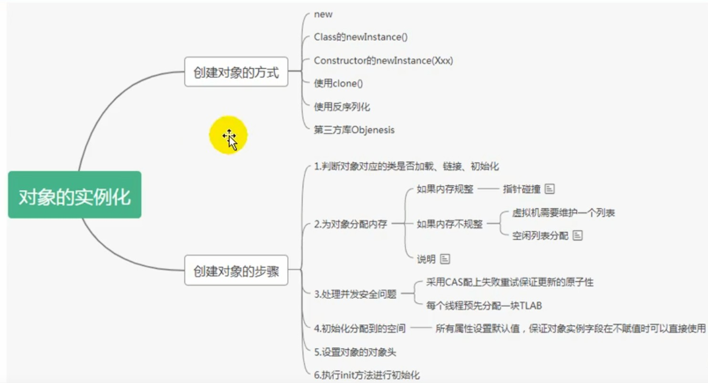
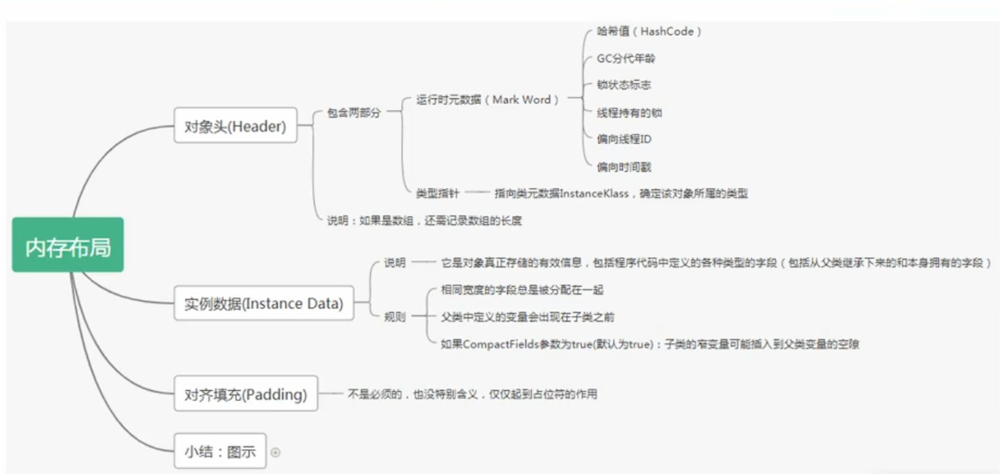
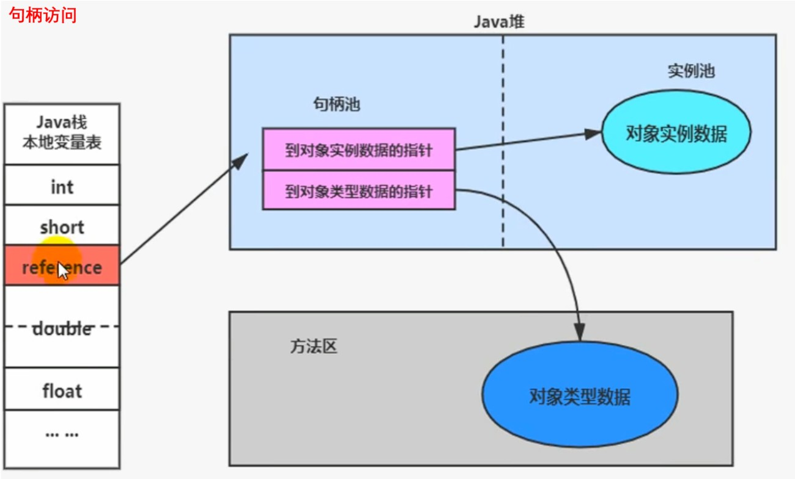
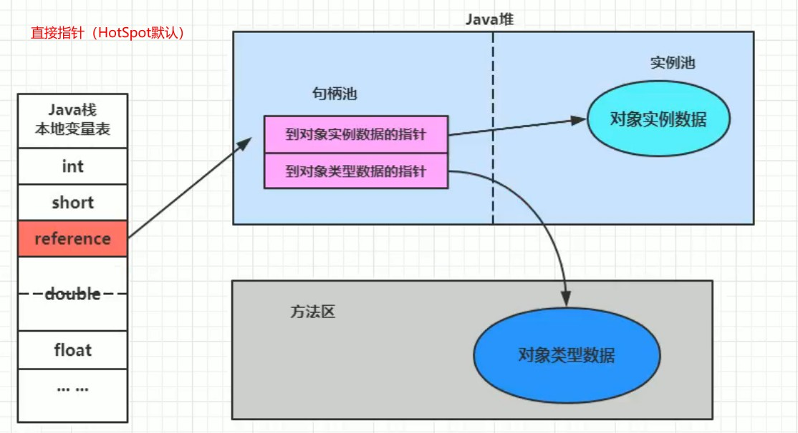

# 对象实例化及过程

1. 在java中，一个对象的创建主要有6个步骤：
    1. 判断对象对应的类是否完成加载、链接、初始化
        - 虚拟机遇到一个`new`指令时，首先去检查这个指令的参数能否在Me他space的常量池中定位到一个类的符号引用，并且检查这个符号引用代表的类是都已经被加载、解析、初始化（类元信息是否存在）。如果没有，那么在双亲委派模型下根据类全限定名加载类的字节码文件，如果没找到文件，就抛出ClassNotFoundException异常，如果找到就加载类并生成对应的class类对象。

    2. 为对象分配内存
        - `如果内存空间规整`：采用指针碰撞的方式为对象分配内存空间，即把指针向空闲内存区域移动对象占用的内存大小相同的距离；
        - `如果内存空间不规整`：此时虚拟机需要维护一个空闲内存列表，采用空闲列表分配。如果内存空间不是规整的， 已使用的内存和未使用的内存相互交错，那么虚拟机会采用空闲列表法来为对象分配内存，即虚拟机维护了一个列表，记录了那些内存块是可用的，在分配的时候会从列表中找到一块足够大的区域分配给对象实例并更新列表上的内容。

    3. 处理并发安全问题
        - 采用CAS失败重试、区域加锁保证更新的原子性
        - 每个线程预先分配一块TLAB ——通过-XX:+UseTLAB开启
        
    4. 初始化分配到的空间
        - 所有属性设置默认值，保证对象实例字段（成员变量）在不赋值时可以直接使用

    5. 设置对象头
        - 将对象的所属类（类的元数据信息）、对象的HashCode、和对象的GC信息、锁信息等数据存储在对象的对象头中，这一过程的具体设置方式取决于JVM的实现。

    6. 执行init()方法进行初始化
        

2. 对象在内存中的存储
    

3. 对象的访问定位       
    - JVM通过栈帧中的对象引用找到具体的对象实例主要有两种方式，分别是`句柄访问`和`直接指针访问`。
    - 句柄访问：在java堆中存在一个句柄池，在句柄池中存储了到对象实例数的指针，通过这个指针指向堆区中的对象的实例数据以及方法区中的对象类数据。

        - 优点：采用标记整理算法执行垃圾回收时对象的地址值会发生变化，用句柄访问时只需要维护句柄池中的对象更改后的地址即可。

        - 缺点：通过这种方法访问对象时需要经过多层跳转，对程序执行效率一定的影响并且需要额外维护一个句柄池，存在一定的空间浪费。

            

    - 直接指针访问：采用直接指针访问时，局部变量表中的引用直接指向堆区的对象实例数据地址值，在对象实例中保存指向方法区中的对象类型数据址。

        - 优点：直接访问堆区的内存地址，提高执行效率并且节省了内存空间

        - 缺点：每次对象的内存地址发生改变时需要去维护栈帧中的引用地址

            
