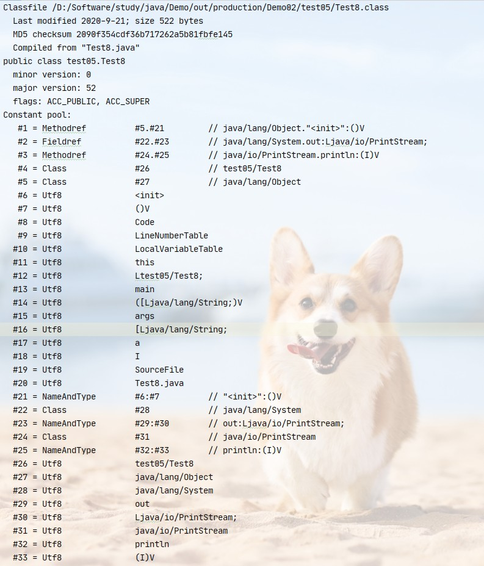
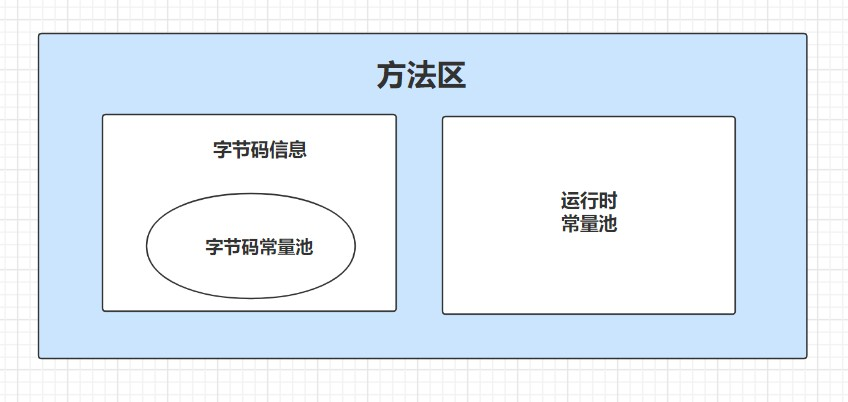

# 虚拟机方法区

1. 方法区是一块独立于堆区的内存空间（非堆），在JDK7及以前叫永久代，在JDK8中改名为元数据区（Metaspace）。
    - 方法区在虚拟机启动时创建，它在实际物理内存中和堆区一样可以是不连续的内存空间。
    - 方法区是一块线程共享区域。
    - 方法区和堆区一样可以动态扩展其内存大小也可以设置固定值。在JDK8中，由于元数据区使用的是物理内存，所以理论上其大小是没有上限的，一般我们只调整其最小值而不用关注其最大值。
    - 方法区主要用于存放加载到系统的类数据，即方法区大小决定了系统可以加载多少个类，如果设置了其最大值并由此导致内存空间不足，就会报OOM异常。

2. 方法区参数设置
    - JDK7及以前： 
    - -XX:PermSize= 用于设置方法区初始值，如-XX:PermSize=100m 方法区默认大小为20.75m
    - -XX:MaxPermSize= 用于设置方法区最大值，如-XX:MaxPermSize=100m 

    -JDK8及以后：
    - -XX:MetaspaceSize= 用于设置方法区（元数据区）初始大小，如-XX:Metaspace=100m
    - -XX:MaxMetaspaceSize= 用于设置方法区最大值，这里一般我们不会设置这个参数而是不限制其最大内存。

3. 注意： 
    - 对于一个64位的jvm来说，方法区默认大小为21m。这是一个初始的高水位线，当方法区占用大小达到这个值后，会触发full GC并卸载掉没用的类（对应的类加载器不在存活）。然后这个高水位线会被重置，新的高水位线会根据释放的空间决定，如果释放的空间不足，那么在不触及到方法区最大空间大小的情况下会提高这个初始值，反之会降低这个值。

    - 在实际应用中，为了避免频繁的Full GC，建议将方法区初始值设置为一个较大的数值（-XX:MetaspaceSize=）。

4. 字节码常量池-运行时常量池
    - 对一个完整的字节码类而言，除了包含字段、方法、接口及类的版本信息等信息外，还要包含一项`常量池表`（Constant Pool Table），包括对各种字面量、类型、属性、方法的符号引用。

    - 对一个常规的java类而言，把它编译成字节码并运行的话是需要很多个类的支持的，而如果把它用到的类都加入到编译后的字节码文件中的话就会导致字节码文件变得异常庞大，所以我们在字节码文件中创建一个常量表用于存放这些外部的引用，然后在类加载过程中（解析阶段）中将这些符号引用指向到运行时常量池中的具体的类型引用（符号引用转换为直接引用）

    - 字节码常量池可以看成是一张表，虚拟机根据这里的编号找到要执行的类型信息。

    - `运行时常量池`是方法区的一部分。在class文件加载到内存中后，其中的常量池表会被存放到方法去中的运行时常量池中。

    - JVM为每个已加载的类型都维护一个常量池，池中的数据象数组一样通过索引访问。

    -  在类加载的解析阶段会把类的符号引用转换为直接引用，即将类型数据直接指向对象在内存中的地址值，这里的对象内存地址就是我们这里的运行时常量池。//待研究

5. HotSpot虚拟机中的方法去演进
    |虚拟机版本 |演进细节|
    | :---: | --- |
    | JDK6 | 有永久代，静态变量存放在永久代上 |
    | JDK7 | 有永久代，但是已经在逐步进行‘去永久代’，字符串常量池、静态变量从永久代移除保存在堆中  |
    | JDK8 | 无永久代，类型信息、字段、方法、常亮保存在本地内存中的元空间，但字符串常量池、静态变量仍然保存在堆中 |

6. 方法区中的垃圾回收
    - 方法区中是存在垃圾回收的，主要收集两部分内容：`常量池中废弃的常量和不再使用的类型。`
    
    - 废弃的常量：常量池中的某一个常量只要没被任何地方引用那么他就会被认作为垃圾被回收。

    - 不再使用的类：要判断一个类是不是不再被使用的条件比较苛刻，主要如下：
        - 该类的所有实例都已经被回收
        - 加载该类的类加载器已经被回收
        - 该类对应的Class对象没有被任何地方引用，无法在任何地方通过反射创建该类的对象或访问该类的方法。 