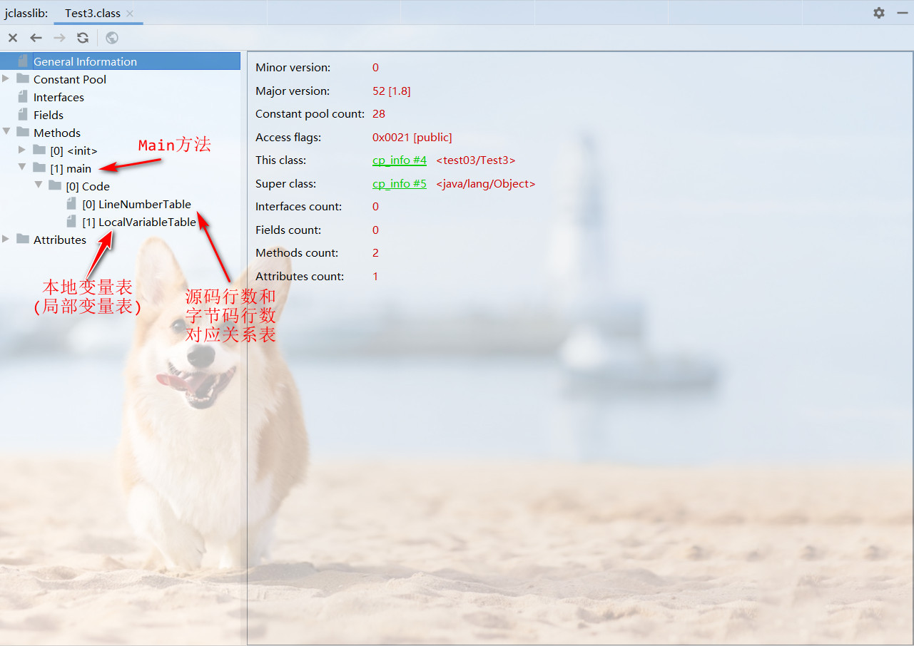
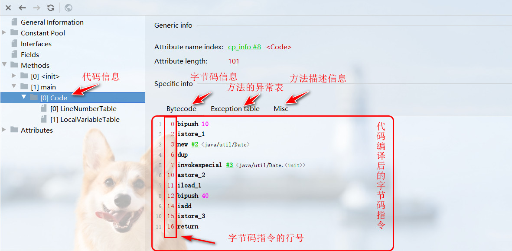
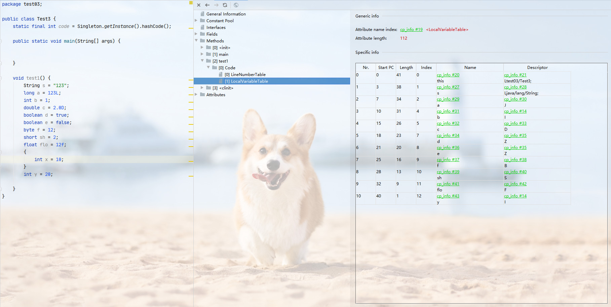

# 局部变量表

## (1)字节码中方法内部结构剖析
1. 虚拟机栈内部分为`局部表量表`、`操作数栈`、`动态链接`、`方法出口`等信息. 本篇介绍局部变量表

2. 首先在idea中安装`jclasslib`插件,在插件库搜索即可. 安装完后选择编译后的class文件,点`view`菜单,选择`show bytecode with jclasslib`选项打开`jclasslib`视图.打开后展示信息如下
    

3. 这里我们以main方法举例,点击`[1]main`展示信息如下
    

4. 接下来打开`[1]main`目录下的`[0]code`目录, 展示信息如下,这里我们的main方法中没有抛出异常,所以异常变为空,不做展开.
    

5. 打开方法描述信息列表`Misc`,信息如下
    

6. 打开左侧代码行数`LineNumberTable`, 其中`Nr.`猜测为这个表的行号, `Start PC`为字节码指令的行号,详细信息参考`4`中的字节码信息表, `Line Number`为字节码对应的源码行号
    

7. 打开`localVariableTable`表,展示信息如下;
        

## (2)局部变量表变量槽(slot)理解

1. 变量槽是局部变量表的基本单位,JVM会为局部变量表的每个元素创建索引,通过索引可以访问到局部变量表中指定的局部变量值

2. 当一个方法被调用时,它的方法参数和局部变量会按顺序复制到局部变量表中的每一个变量槽上, `对于实例方法而言,其变量槽第一个元素一定是this对象!`

3. 在局部变量表中,32位以内的类型只会占一个槽(包含返回值地址), 64位类型占用两个变量槽, 如果需要访问64位的局部变量,只需要使用前面的一个槽的索引即可
    - `byte`, `short`, `char`, `float`, 在存储前会被转换为`int`,`boolean`也会被转换为`int`, 其中`0`表示`false`, 非`0`表示`true`. 
    - `long` 和`double`会占据两个变量槽.

4. 栈帧中的变量槽是可以复用的,一个局部变量过了它的作用域,那么在它的作用域之后申明的变量可能会复用过期的局部变量的槽位从而达到节省资源的目的.

    
    - 上图中`index`列即为JVM为每个元素创建的索引. 从图中可以看出,`long`和`double`占用两个变量槽, 其他类型占用一个变量槽.
    - 对于一个实例方法而言,在局部变量表中第一个元素是`this`对象.
    - 在代码中我们定义了一个局部变量 `x`, 但是在局部变量表中是没有这个元素的, 因为`x`作用域是在定义它的花括号内,在花括号之后就失效了,而我们在后面又定义了一个变量 `y`, 这里的 `y`复用了 `x` 的变量槽.

