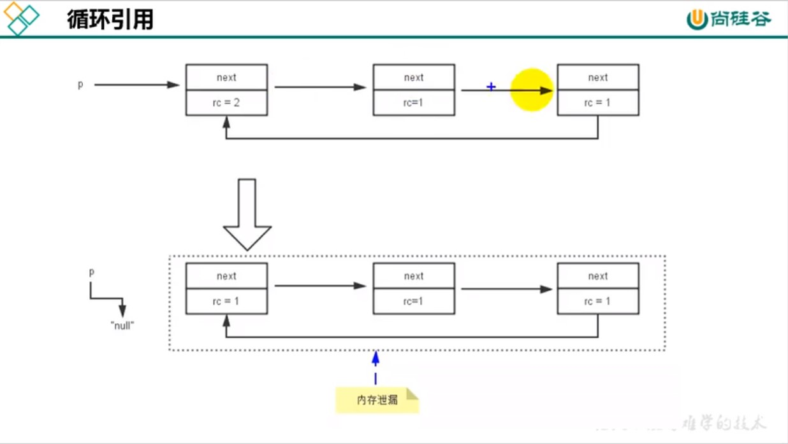

## 垃圾收集标记算法

### 一、垃圾收集的标记阶段

1. 在执行垃圾收集之前需要`先确定哪些对象是存活对象，哪些对象是已经死亡的对象`。只有`被标记为死亡的对象`才会被当做垃圾回收掉，并释放其占用的内存空间，这个过程称为`标记阶段`。

2. 在jvm中，当一个对象不再被任何存活的对象所引用时，这个对象就会被标记为死亡的对象。一般判断对象是否存活有两种方式，分别是`引用计数算法`和`可达性分析算法`。

### 二、引用计数算法（Reference Counting）

1. 引用计数算法实现起来相对比较简单，对每个对象保存一个整形的引用计数器用于记录当前对象被引用的情况。

2. 对于一个对象A，只要有任何一个对象引用了对象A，那么A的计数器就会+1，当引用失效时计数器就-1。当一个对象的引用计数为 0 时就表示没有其他对象引用这个对象，那么这个对象就会被当做垃圾回收掉。

3. 优点：
    - 实现简单，垃圾对象便于辨识。
    - 判定效率高，回收没有延时。

4. 缺点：
    - 需要单独的字段存储计数器，这样会导致额外的内存空间开销。
    - 每次赋值都需要进行加减法操作，增加了额外的时间开销。
    - 引用计数算法没办法解决循环引用问题，这直接导致java放弃使用引用计数算法作为标记算法。
        ```java
        public class A{
            Objece reference = null;
            
            public static void main(String[] args){
                A a1 = new A();
                A a2 = new A();

                a1.reference = a2;
                a2.reference = a1;
            }
        } 
        ```
5. 小结：
    - 在java中没有使用引用计数算法，但是在Python中是支持引用计数算法的。
    - 在Python中，解决循环引用主要有两种方式，一是`在合适的时机手动解除`，二是`使用弱引用`。

### 三、可达性分析算法

1. 相对于引用计数算法而言，可达性分析算法同样具有`实现简单、执行高效`等特点。可达性分析算法可以有效地`解决引用计数算法中的循环引用问题`，防止出现内存泄漏。

2. 实现思路：
    - 可达性分析是以根对象集合（GC Roots，一组必须活跃的引用）为起始点，从上到下`搜索被根对象集合所连接的对象是否可达`。
    - 使用可达性分析算法分析后，未被标记为垃圾的对象都会被跟对象直接或间接地连接着，搜索所走过的路径称为`引用链(Reference Chain)`。
    - 如果目标对象没有被任何的引用链连接，则该对象是不可达的，说明对象已经死亡，可以被标记为垃圾。
    - 在 可达性分析算法中，只有被根对象`直接或间接连接`的对象才是存活的对象。

3. 在java中，GC Roots包含以下几类元素：
    - 虚拟机栈中引用的对象，各个线程中被调用的方法中使用到的参数、局部变量等。
    - 本地方法栈内引用的对象。
    - 方法区中静态属性引用的对象（java类中静态的引用类型指向的对象）。
    - 方法区中常量引用的对象（字符串常量池里面的引用）。
    - 所有被同步锁synchronize所持有的对象。
    - java虚拟机内部的引用，如基本数据类型对应的Class对象、常驻的异常对象、系统类加载器等。
    - 反应java虚拟机内部情况的对象。

4. 除了以上的固定的GC Roots之外，根据用户选择的垃圾收集器和当前回收的内存区域不同，还可以有其他的临时性的Root对象。
    - 如果我们只针对新生代进行垃圾收集，那么此时老年代中的部分对象也可以作为GC Root节点。比如说在新生代中一个对象通过老年代的一个对象间接地被前面的GC Roots所引用，那么此时老年代的对象就可以作为一个GC Root使用。

5. 由于Root采用栈方式存放变量和指针，如果一个指针保存了堆内存（要被回收的区域）的变量，但是自己又不在堆内存（要被回收的区域）中，那么他就是一个GC Root节点

6. 如果要使用可达性分析来判断对象是否可以被回收，那么需要在一个可以保证一致性的快照中进行。如果无法满足这一条件，那么就无法保证分析结果的准确性。这也是导致GC时必须STW的一个重要原因。

### 四、对象的finalization机制

1. java提供对象终止机制(finalization)机制允许开发人员提供`对象被销毁之前的自定义处理逻辑`。当垃圾收集器发现没有任何引用指向内存中的某个对象时，即在回收这个对象之前，`总会先调用该对象的finalize()方法(继承自Object类)`。finalize()方法允许在子类中被重写，用于对象被回收时进行资源释放。

2. 永远不要主动调用某个对象的finalize方法，应该交由垃圾回收机制调用。理由如下：
    - 在执行finalize时可能会导致该对象复活。
    - finalize()执行时间是没有保证的，它完全由GC线程决定。在极端情况下，若不发生GC，则finalize()方法永远没有执行机会。
    - 不合理的重写finalize()方法可能会严重影响GC性能。

3. 如果从所有的根节点都无法访问到某个对象，说明该对象已经不再被使用，一般情况下应该被当做垃圾进行回收，但是`在某些特殊情况下，一个无法被触及的对象可能会在某一条件下复活自己`。 为此虚拟机定义以下三种状态表示对象状态：
    - 可触及的：从根节点开始，可以触及到这个对象。
    - 可复活的：对象的所有引用都已经被释放，但是可能会在finalize()方法中复活自己。
    - 不可触及的：对象的finalize()方法被调用并且没有复活自己。`处于不可触及状态的对象不可能被复活`，因为`finalize()方法只会被调用一次`。

4. 判断一个对象是否可以被回收至少要经历两次标记过程：
    - 如果对象 ObjA 到 GC Roots 没有引用链，则进行第一次标记。
    - 进行筛选，判断对象是否有必要执行finalize()方法：
        - 如果对象没有重写finalize()方法或finalize()方法已经被调用过，则虚拟机视其为`没有必要执行`，该对象状态被设置为`不可触及`状态
        - 如果对象重写了finalize()方法，并且该方法还未被执行过，那么ObjA对象会被插入到F-Queue队列中，一个由`虚拟机创建`的、`低优先级`的`Finalizer`线程触发其finalize()执行。
        - finalize()方法是对象逃脱死亡的最后机会，稍后GC会对F-Queue队列中的对象进行第二次标记。如果ObjA在引用链的任何位置上与一个对象建立了连接，那么在第二次回收时，ObjA会被移出“即将回收”集合。在此之后，如果对象再次出现没有被任何引用所指向，那么finalize()方法不会被调用，即此时对象会直接变为不可触及状态。也就是说finalize()方法只会被调用一次。