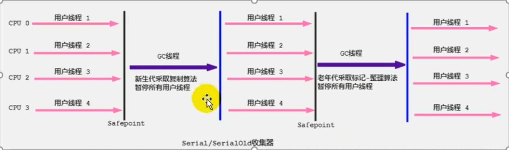
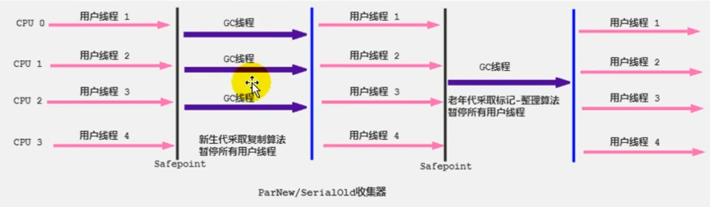
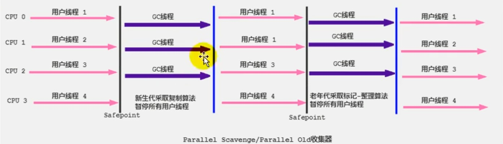
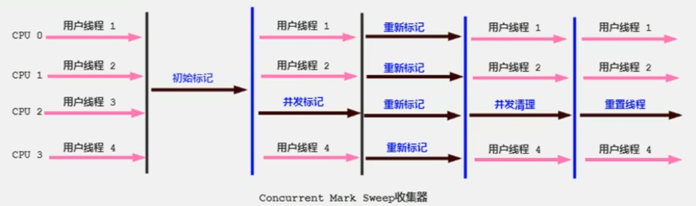

## 垃圾收集器

### 一、Serial回收器
1. Serial 收集器是最基本、历史最久的收集器，是Client模式下的默认收集器。

2. Serial 收集器采用`复制算法`、`串行回收`和`'STW'机制`的方式执行垃圾收集。

3. 对于老年代而言，Serial收集器还提供了`用于收集老年代`的Serial Old收集器，Serial Old收集器也是采用`串行回收`和`'STW'机制`，但是回收算法采用的是`标记压缩算法`。
    - Serial Old是Client模式下的默认的老年代垃圾收集器。
    - Serial Old在Server模式下主要有两个用途：一是与新生代的Parallel Scavenge配合使用。二是作为老年代CMS收集器的后备方案。

4. Serial是一个单线程收集器，这里的单线程不仅说明它只会开启一个线程去完成垃圾收集工作，更重要的是在垃圾收集时，`必须暂停所有的其他工作线程`，直到他收集结束(STW机制)。

5. Serial收集器是一种`简单高效`的收集器，对于单个CPU的运行环境而言Serial收集器由于没有线程交互的开销，专心做垃圾收集自然就可以获取最高的收集效率。
    - 在桌面应用场景中，可用内存一般不大，可以在较短的时间内完成垃圾收集

6. 在HotSpot虚拟机中，可以使用 `-XX:+UseSerialGC`指定年轻代和老年代都使用串行收集器。等价于新生代使用`Serial `老年代使用`Serial Old`

### 二、ParNew收集器
1. `ParNew收集器`相当于Serial收集器的`多线程版本`，它只能对`年轻代`进行回收。

2. 相比于Serial收集器而言，ParNew收集器除了采用并行回收外，两款收集器基本上没什么区别。在年轻代中都是采用`复制算法`和`STW机制`。

3. ParNew收集器是很多JVM在Server模式下新生代的默认收集器。

4. 由于平行回收需要耗费较多的CPU资源，而老年代的回收频率并不高，所以在老年代中默认使用的是单线程回收。对于新生代，由于回收频率较高，使用并行回收能有效提高回收效率。

5. 在多核CPU中，并行回收能有效提高硬件资源利用率，提高垃圾收集速度。但是对于单核CPU环境而言，ParNew收集器并不比Serial收集器效率高，因为并行回收中线程的切换也需要额外产生一些资源消耗。

### 三、 Parallel收集器
1. Parallel收集器是一款注重吞吐量的收集器，对于新生代而言，它的`Parallel Scavenge`收集器和ParNew收集器一样也是使用并行回收的方式进行垃圾收集，同样采用复制算法、并行回收和`STW`机制。

2. 和ParNew收集器不同的是，`Parallel Scavenge收集器的目标是达到一个可控制的吞吐量。`

3. 高吞吐量可以有效利用CPU的时间，尽快完成程序的运算任务，主要适合后台运算量大并且不需要太多交互的任务。如批量信息处理、订单处理、工资支付、科学计算等。 `一般在服务器环境中默认使用Parallel收集器。`

4. 在JDK1.6时，Parallel提供了执行老年代垃圾收集的`Parallel Old`收集器用来替代老年代的Serial Old收集器。Parallel Old收集器采用了`标记压缩算法、并行回收机制和STW机制。`

5. Parallel收集器适用于高吞吐量的业务场景，`在JDK8中，默认使用Parallel Scavenge + Parallel Old收集器。`

### 四、CMS收集器(Concurrent-Mark-Sweep)
1. 在JDK1.5版本中，推出了一款具有跨时代意义的垃圾收集器CMS收集器，它是Hotspot虚拟机中`第一款真正意义上的并发垃圾收集器，第一次实现了让垃圾收集线程与用户线程同时工作。`它使用的是标记-清除算法，也会存在`STW`。

2. CMS收集器关注的点是尽可能的缩短垃圾收集时用户线程的停顿时间。较短的停顿时间能提高程序与用户的交互性，良好的响应速度能有效提升用户体验。

3. 由于设计原因，`CMS收集器无法与Parallel Scavenge收集器搭配使用`，所以使用CMS收集器收集老年代时，新生代垃圾收集器只能从`ParNew`和`Serial`收集器中选一个。

4. CMS收集器工作过程主要分为4个阶段，即`初始标记阶段`、`并发标记阶段`、`重新标记阶段`、`并发清除阶段。`
    - `初始标记阶段(Initial-Mark)`：在这个阶段中，程序的所有工作线程都会因为Stop-The-World机制而出现短暂的暂停，`这一阶段主要任务是标记出GC Roots能直接关联到的对象`，标记完成之后就会恢复之前被暂停的所有应用线程。由于关联的对象比较小，所以这里的`速度非常快`。
    - `并发标记(Concurrent-Mark)`：`从GC Roots的直接关联对象遍历整个对象图的过程`，这一过程耗时较长，但是不需要停顿用户线程，可以与应用程序线程一起并发运行。 
    - 
