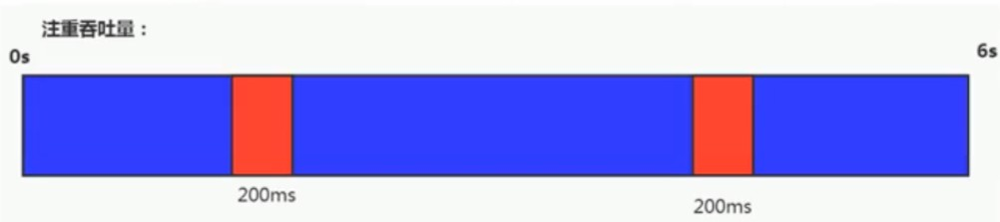
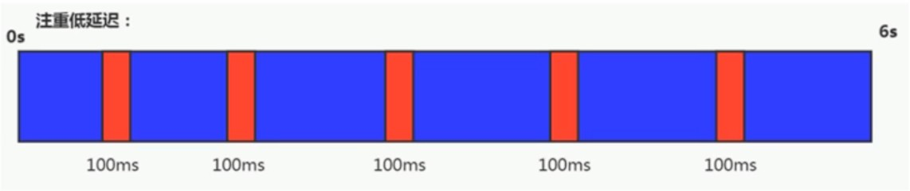
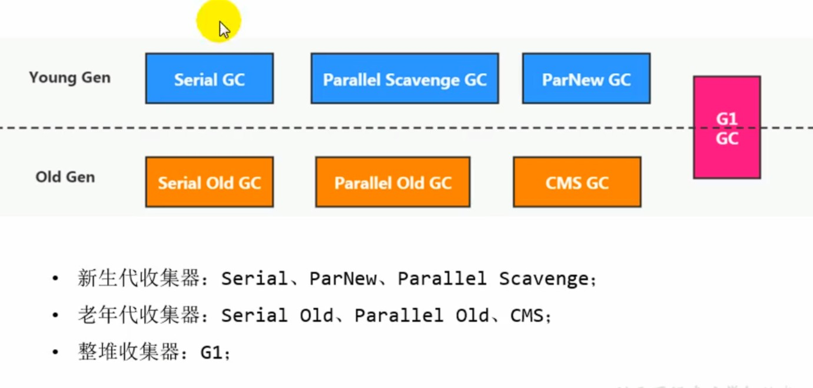
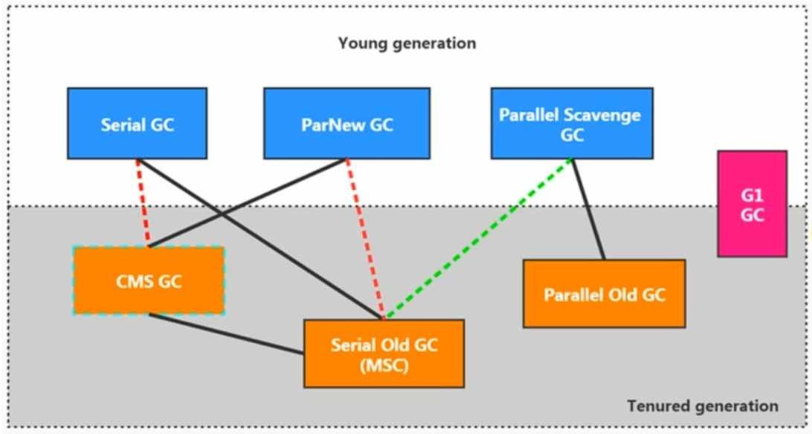

## 垃圾收集器

### 一、 评估GC的性能指标
1. 吞吐量：运行用户代码时间占总运行时间的比例。
    - 吞吐量就是`CPU用于执行用户代码的时间 `与` CPU总消耗时间`的比值。即吞吐量 = 运行用户代码时间 / (运行用户代码时间 + 垃圾收集时间)。如程序总共运行了100分钟，其中垃圾收集消耗了1分钟，那么吞吐量就是99%

    - 吞吐量优先意味着程序能容忍较高的暂停时间，因此，高吞吐量的程序有更长的时间基准，快速响应是不必要考虑的。

2. 垃圾收集开销： 吞吐量的补数，垃圾收集时间占总运行时间的比例。

3. 暂停时间：执行垃圾收集时，程序的工作线程被暂停的时间。
    - 暂停时间是指一个时间段内应用程序暂停，让GC线程执行的状态。在暂停时间内是没有应用程序执行的。

    - 暂停时间优先意味着尽可能的让每次STW的时间最短。 

4. 收集频率：相对于应用程序的执行，收集操作发生的频率。

5. 内存占用：java堆区所占用的内存大小。

- 上面5项中，`吞吐量`、`暂停时间`、`内存占用`三者最多只能同时满足两项。

### 二、java中的垃圾收集器

1. 目前java中有7款主流的垃圾收集器如下，对应的作用区域如下图所示:
    - 串行回收器：Serial 、 Serial Old
    - 并行回收器：ParNew 、 Parallel Scavenge 、Parallel Old
    - 并发回收器：CMS 、 G1     

2. 各种垃圾收集器的作用区域和互相之间的组合关系都不相同，具体如下图所示：

    - 两种收集器之间有连线表示他们可以搭配使用
    - 其中 `Serial Old`作为`CMS`出现问题后的后备方案使用。
    - `红色虚线 `表示由于维护和兼容性测试的成本，在 `JDK8` 时将 `Serial + CMS`、`ParNew + Serial Old`这两种组合声明为废弃，并在 `JDK9` 中完全取消了对这些组合的支持。
    - `绿色虚线 `表示在` JDK14 `中弃用 `Parallel Scavenge `和 `Serial Old`组合
    - `青色虚线框 `表示在` JDK14 `中删除CMS收集器
    - `到JDK14版本时，只剩下 'Serial + Serial Old'、'Parallel Scavenge + Parallel Old'、'G1'这三种收集器可用`

3. 在java中之所以设计这么多种垃圾收集器主要是因为java的使用场景很多，针对不同的使用场景对垃圾收集有不同的需求，不存在一个最优的收集器组合方案，只能针对不同的业务场景选择不同的收集器方案。