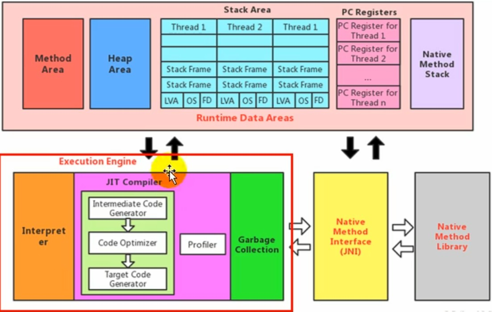
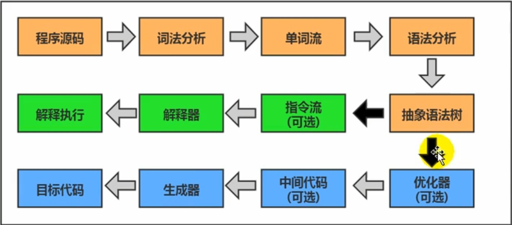
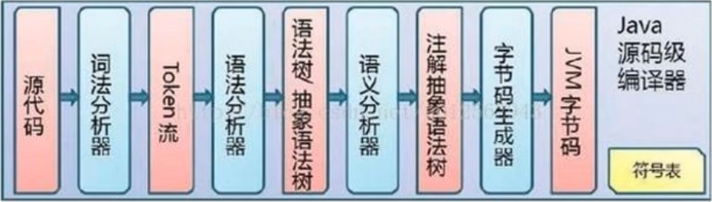
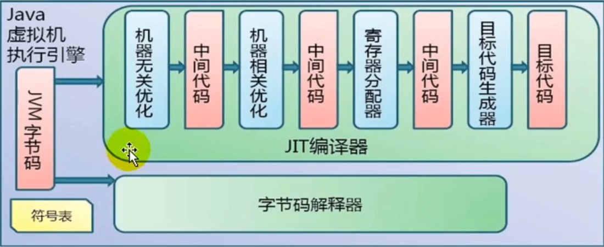
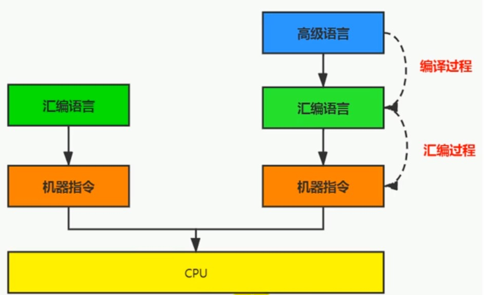
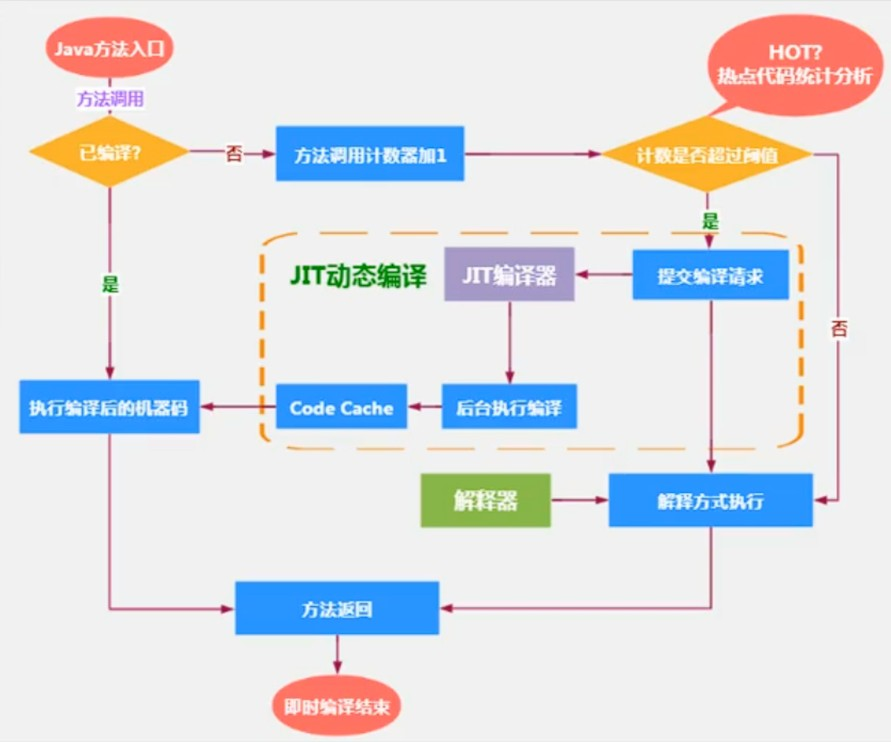
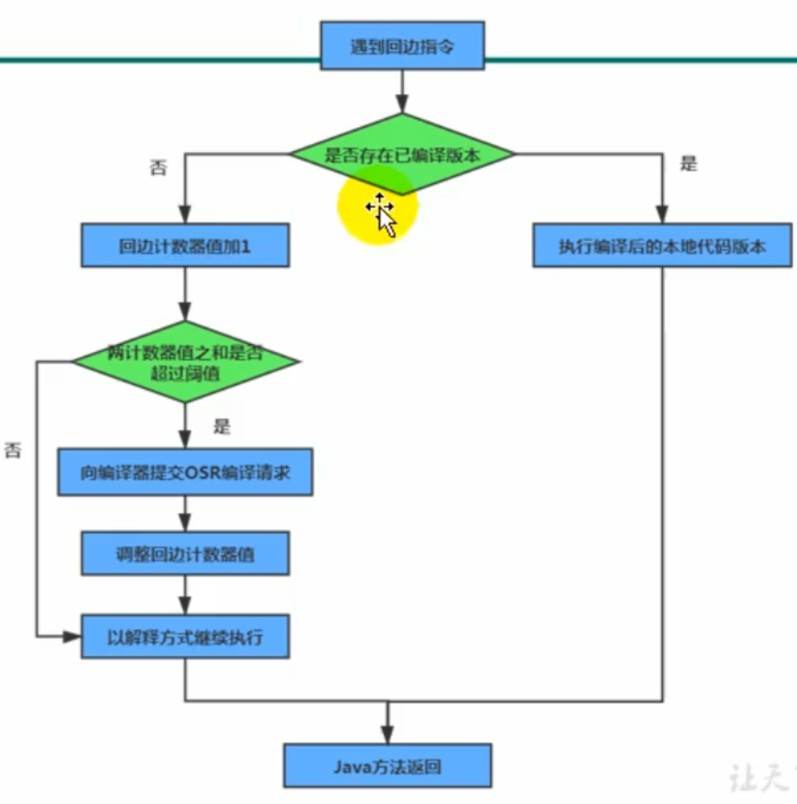

## 执行引擎

### 一、执行引擎概述
1. 执行引擎是java虚拟机的核心组成部分之一，虚拟机的执行引擎是由软件自行实现，可以不受物理机的制约定制指令集与执行引擎的体系结构，能够执行不被硬件直接支持的指令集格式。

2. JVM的主要任务是负责装载字节码到其内部，但是字节码不能直接运行在操作系统上，要想让java程序执行起来就必须要用到执行引擎。执行引擎的作用就是`将字节码指令解释/编译成对应平台上的本地机器指令，简单点理解就是将高级语言翻译为机器语言`。

### 二、java代码的编译和执行过程
1. 大多数的程序代码转换为物理机的目标代码或虚拟机的指令集之前都需要经过下面的几个步骤

2. java代码的编译过程（javac）如下，其结果是生成.class字节码文件：

3. 字节码文件由执行引擎来执行，流程图如下：

4. 解释器和编译器：
    - 字节码解释器：虚拟机启动时会根据预定义的规范对字节码采用逐行解释的方式执行，将字节码文件中的每条内容翻译成平台对应的机器码执行。

    - 编译器（JIT）：将源码直接编译成机器平台相关的机器语言

    - 编译器的执行效率更高但是启动时间较长，解释器执行效率低，但是启动迅速。一般java是采用解释器和编译器同时执行，在程序启动时使用解释器，当程序运行到一定的时间后，符合特定条件的代码片段将被编译成机器码直接运行。

### 三、机器码、指令、汇编语言
1. 机器码：采用二进制表示的指令，由0和1组成，执行速度最快

2. 指令：将特定序列的0和1的机器码简化成对应的指令，如mov。不同的硬件平台对应的机器码可能不相同，所以不同的硬件平台使用同一种指令对应的机器码也不一定相同。

3. 指令集：不同的硬件平台各自支持的指令是不同的，因此每个平台锁支持的指令称之为对应平台的指令集。

4. 汇编语言：由于指令集的可读性太差，所以就产生了汇编语言。在汇编语言中使用`助记符(Mnemonics)`来替代机器指令的操作码，用`地址符号(Symbol)或标号(Label)`来代替`指令或操作数的地址`。在不同的硬件平台，汇编语言对应着不同的机器语言指令集，通过汇编过程转换为机器指令。

5. 高级语言：高级语言比汇编语言和机器语言更接近于人类的语言，机器在执行高级语言时`任然需要将程序编译成机器的指令码`，这个过程叫解释程序或编译程序。

6. 字节码：字节码是一种中间状态的二进制代码它比机器码更抽象，需要直译器转译后才能成为机器码。字节码主要是为了实现特定软件运行，和软件环境、硬件环境无关。

### 四、解释器
1. 为了满足java程序实现跨平台性，避免采用静态编译的方式直接生成本地机器指令，因此诞生了由解释器在运行时采用逐行解释字节码执行程序的想法。

2. 解释器真正意义上所承担的角色就是一个运行时的翻译者，将字节码指令翻译成对应硬件环境的机器码，当一条字节码指令被解释执行完成后，再根据PC寄存器中记录的下一条需要被执行的字节码指令执行解释操作。

3. 在java发展中，存在两套解释执行器，一种是`字节码解释器`，一种是`模板解释器`，现在普遍使用模板解释器。
    - 字节码解释器是在程序执行时通过纯软件代码模拟字节码的执行，效率低下。
    - 模板解释器是将每一条字节码和一个模板函数相关联，模板函数中直接产生这一条字节码执行时的机器码，在很大程度上提高了解释器的性能。

### 五、JIT编译器
1. 为了解决解释器在执行效率上偏低的问题，jvm平台支持一种即时编译技术。即时编译器是为了避免函数被解释执行，将整个函数编译成机器码，这种方式可以大幅度提高程序执行效率。

2. HotSpot虚拟机是目前市面上高性能虚拟机的代表作。它采用的是`解释器和即时编译器并存`的架构，在程序运行时会选取最合适的方式优化本地代码的执行时间。

3. 即时编译器虽然说执行效率更高，但是它在编译程序为机器码的时候耗费的时间比较长，如果纯粹采用即时编译器运行代码，会导致程序启动时间较长。而如果加入解释器，那么在程序启动时可以先使用解释器解释执行代码，等程序执行到一定程度再采用即时编译器编译运行。

4. 在java语言中，编译器是一个比较模糊的概念，它可以指的是把java源码编译成字节码的过程（`前端编译器`），也可以是指的在程序运行期间通过JIT编译器将字节码转换成本地机器码的过程（`后端运行期编译器`），还可以是使用`静态提前编译器（AOT）`直接把java源码编译成机器码的过程。

5. 热点代码探测技术：`JIT编译器在程序运行期间会针对那些被频繁调用的热点代码做出深度优化，将其直接编译为对应平台的本地机器指令来提升java程序执行性能`。
    - 一个被调用多次的方法，或一个方法体内部循环次数较多的循环体都可以被称之为`热点代码`，都会在程序执行过程中被直接编译成本地机器指令执行，由于这种方式 发生在方法执行过程中，因此也被称为栈上替换，或简称为`OSR(On Stack Replacement)编译`。
    - JVM会为每个方法建立两个不同类型的计数器，分别为`方法调用计数器(Invacation Counter)`和`回边计数器(Back Edge Counter)`。其中方法调用计数器用于统计方法的调用次数，回边计数器用于统计循环体的执行的循环数。

6. 方法调用计数器用于统计方法被调用的次数，它的阈值在Client模式下是1500次，在Server模式下是10000次，超过这个阈值会触发JIT编译。这个阈值可以使用`-XX:CompileThreshold`来设置。

7. 当一个方法被调用时，会先检查该方法是否存在被JIT编译过的版本，如果存在就优先使用JIT编译后的代码来执行，如果不存在编译后的代码，就将该方法的计数器+1，如果方法调用计数器和回边计数器值之和超过方法调用计数器的阈值，就会向即时编译器提交一个该方法的代码编译请求。

8. 热度衰减：如果不做任何设置，方法的调用此时统计的不是方法被调用的绝对次数，`而是一段时间内方法被调用的次数`。当超过`一定的时间限度`，如果方法的调用次数任然不足以让他提交给即时编译器，那么这个方法的`方法调用计数器就会减少一半`，这个过程称为`方法调用计数器热度的衰减(Counter Decay)`，而这段时间称为`此方法统计的半衰周期(Counter Half Life Time)`。

9. 进行热度衰减的动作是在虚拟机进行垃圾回收的时候顺便进行的，可以使用参数`-XX:-UseCounterDecay`来关闭热度衰减，这样的话只要系统运行的时间足够长，绝大多数方法都会被编译成本地代码。同样的，可以使用参数`-XX:CounterHalfLiteTime`设置半衰周期的时间，单位是秒。

10. 回边计数器：作用是用于统计一个方法中`循环体代码执行的次数`。在字节码中遇到控制流向后跳转的指令称为回边(Back Edge)。

11. 默认情况下，HotSpot虚拟机采用解释器和编译器并存的架构。我们也可以根据程序应用场景通过命令显式决定虚拟机运行时的运行方式
    - -Xint：完全采用解释器模式执行程序；
    - -Xcomp: 完全采用及时编译模式执行程序。如果即时编译出现问题，解释器就会介入执行。
    - -Xmixed: 采用解释器+即时编译器混合模式执行
    - **TODO:** 这里存在一个问题，前面说热点探测技术的阈值是计数器到达10000次，也就是说在计数器小于10000的时候使用的是解释器执行，但是在实际测试的时候发现当程序执行册数设置为5000的时候，使用混合模式和解释器模式执行代码耗时还是存在较大的差距
    ```java
        /**
         * 执行1000000次：
         *  -Xint: 纯粹使用解释器模式执行代码 4999ms
         *  -Xcomp: 纯粹使用编译器执行代码  530ms
         *  -Xmixed: 使用混合模式执行代码     531ms
         * 
         */
        public class Test9 {
            public static void main(String[] args) {
                long millis = System.currentTimeMillis();
                test1(1000000);
                System.out.println("共耗时：" + (System.currentTimeMillis() - millis) + " ms");
            }
            public static void test1(int count) {
                for (int i = 0; i < count; i++) {
                    label:
                    for (int j = 2; j <= 100; j++) {
                        for (int k = 2; k <= Math.sqrt(j); k++) {
                            if (j % k == 0) {
                                continue label;
                            }
                        }
                    }
                }
            }
        }
    ```

12. 在HotSpot虚拟机中，内嵌了两个JIT编译器，分别是Client Compiler和Server Compiler，一般简称为C1和C2编译器。开发中可以使用 -Client和-Server制定使用哪一种即时编译器。
    - -Client：制定虚拟机运行在Client模式下，并使用C1编译器。C1编译器会对代码进行简单地优化，耗时较短。
        - 方法内联：将引用的函数代码编译到引用点处，这样可以减少栈帧的生成，尖山参数传递及跳转过程。
        - 去虚拟化：对唯一的实现类进行内联。
        - 冗余消除：在运行期把一些不执行的代码折叠掉。

    - -Server: 制定java虚拟机运行在Server模式下，并使用C2编译器。C2编译器进行耗时较长的优化，以及激进的优化。但是优化的代码执行效率高。C2的优化主要体现在全局层面，开启逃逸分析是C2编译器优化的基础
        - 标量替换：用标量值替换聚合对象的属性值。
        - 栈上分配：对于未逃逸的
        对象进行栈上分配。
        - 同步消除：清除同步操作（synchronized）


