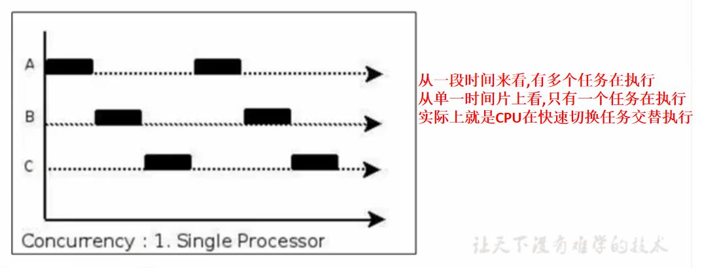

## 扩展知识点

### 一、并行与并发
1. 并发(Concurrent)
    - 在操作系统中,指的是`某个时间段内`有几个程序都处于已启动状态到运行完毕之间,且这几个程序是在同一个处理器上面执行的.
    - 并发不是真正意义上的"同时进行",只是CPU把一个时间段分为几个时间片,然后在这几个时间片内切换不同的线程执行。由于CPU的执行时间是非常快的，所以用户只会感觉是多个程序在同时执行。

2. 并行(Parallel)
    - 当系统有一个以上的CPU时,一个CPU执行一个进程时,另一个CPU可以执行另一个进程,两个进程之间互不干扰,这种情况称之为并行(Parallel).

3. 异同点
    - 并发指的是`多个事件`在`同一段时间内`发生
    - 并行指的是`多个事件`在`同一时间点上`发生
    - 并发执行的多个任务是`互相抢占资源`的
    - 并行执行的多个任务是`互不干扰`的
    - 只有存在多个CPU或者一个CPU存在多个核心的时候才会有并行执行
    