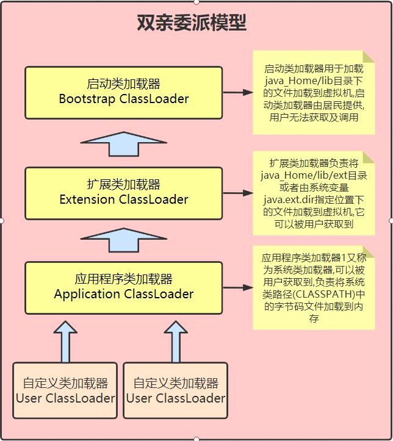
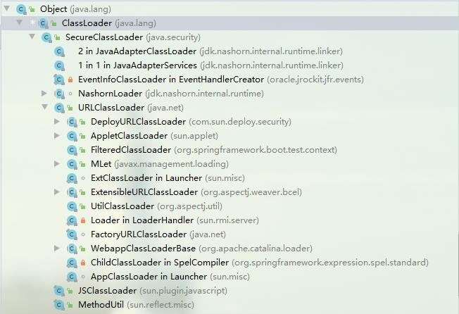
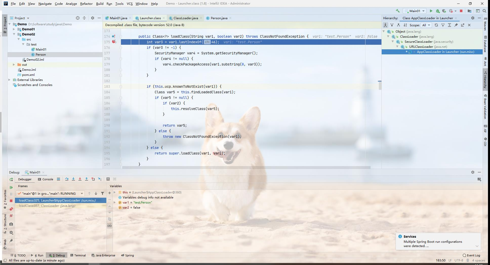
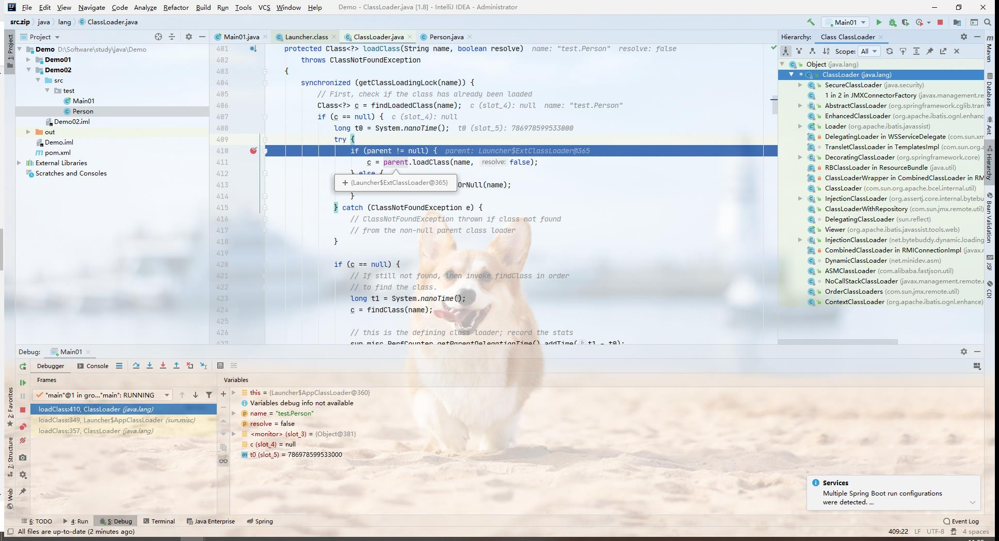
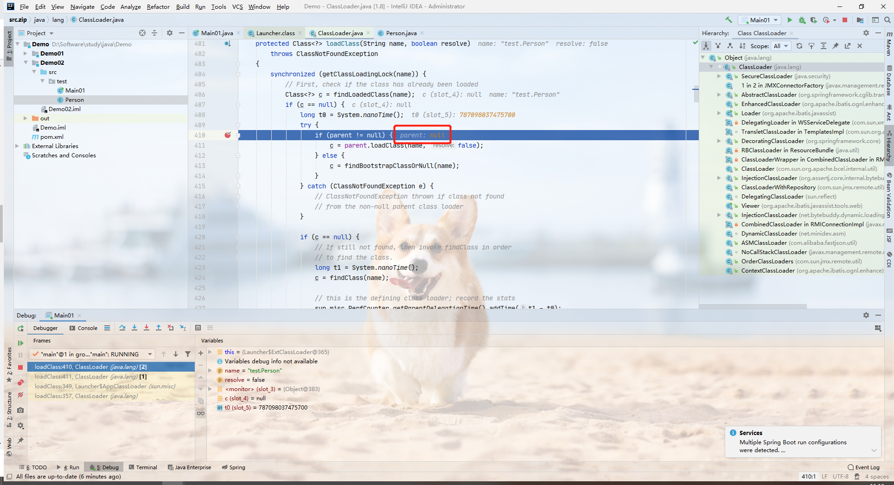
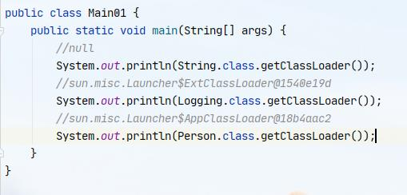

# 双亲委派模型

1. 类加载机制   
    - java类加载过程第一阶段为`加载`, 即通过类的全限定名(包名+类名)将类的字节码文件加载到内存中并存放到元数据区.  
    - 在java中判断两个类是否相等的一个必要条件就是是否是同一个类加载器加载的,如果加载这两个类的类加载器不同,那么即使其他信息完全一致这两个类也不相等.         
    - 在java中,类加载使用了`双亲委派机制`, 即要加载一个类的时候会先让他的父类加载器尝试加载,如果父类加载器能加载就会加载这个类,否则就将其返回到子类加载器去加载. 双亲委派机制可以保证在不去手动干预的情况下每个类在内存中都只存在一个字节码文件, 保证了系统的稳定性.            
    

2. 类加载器介绍
    - java中的类加载器除了启动类加载器(BootstrapClassLoader)之外,其他的均继承自ClassLoader类,其继承关系如下. 

    - 通过继承关系我们可以看出,扩展类加载器(ExtClassLoader)和系统类加载器(AppClassLoader)均是`sun.misc.Launcher`类中的内部类,并且他们都继承自 `URLClassLoader`. 在官方源码注释上对其解释如下:
        ```
         This class loader is used to load classes and resources from a search
         path of URLs referring to both JAR files and directories. Any URL that
         ends with a '/' is assumed to refer to a directory. Otherwise, the URL
         is assumed to refer to a JAR file which will be opened as needed.
         The AccessControlContext of the thread that created the instance of
         URLClassLoader will be used when subsequently loading classes and
         resources.
         The classes that are loaded are by default granted permission only to
         access the URLs specified when the URLClassLoader was created.
        ```
        简单点理解就是这个类加载器从指向`JAR`文件和目录的`URL`的搜索路径加载类和资源。即我们加载的jar包都是基于这个类加载器加载的.

    - 在程序启动时会调用`AppClassLoader`类中的`loadClass(String var1, boolean var2)`方法,在该方法中会进一步调用父类的加载方法`super.loadClass(var1, var2);`, 在父类的`loadClass`中基于多态改变其中的`parent`属性值来调用不同的类加载器逐步尝试加载传入的类,直到加载成功为止     
    这里我们在程序中加载了3个类,通过字节码对象获取调用他们的类加载器结果如下. 通过打印结果我们可以看出, 由于`String`类在`java.lang`包下面,所以它是由`BootStrapClassLoader`来加载,而由于`BootStrapClassLoader`属于`JVM`,所以这里我们获取到的值为`null`,而`com.sun.javafx.binding.Logging`是属于`java_home\lib\ext`目录下的jar包中的类,所以它是被`ExtClassLoader`加载,最后`Person`类是我们自定义的类,所以被`AppClassLoader`加载      

3. 双亲委派机制安全性
    - 在验证双亲委派机制的安全性之前,我们先在项目中添加一个`java.lang.String`类,并在其中添加一个静态代码块用于识别该类,代码如下:
        ```java
        package java.lang;
        public class String {
            static{
                System.out.println("自定义的String对象");
            }
        }
        ```
        然后在main方法中创建该类的对象并执行,此时我们会发现实际加载的是`java`提供的`String`类.

    - 接下来我们在之前定义的`String`类中添加一个`main`方法并输出一句话,代码如下
        ```java
        package java.lang;

        public class String {
            public static void main(String[] args) {
                System.out.println("自定义的String对象");
            }
        }
        ```
        此时执行程序后会输出
        ```
        错误: 在类 java.lang.String 中找不到 main 方法, 请将 main 方法定义为:
        public static void main(String[] args)
        否则 JavaFX 应用程序类必须扩展javafx.application.Application
        ```

    - 上面案例一中,我们定义了一个`String`类,在加载该类的时候会将`java.lang.String`作为类的全限定名来加载该类, 根据双亲委派模型可知,JVM加载该类的时候该类全限定名会传递到`BootStrapClassLoader`中,`BootStrapClassLoader`根据该类名会加载JDK自带的String类, 在这种情况下可以屏蔽第三方的恶意攻击代码.

    - 在上面案例二中,我们在自定义的`java.lang.String`中定义了一个`main`方法,在执行后他会报错`在类中找不到main方法`,因为在这种情况下实际加载到内存的是JDK提供的`String`类,执行的时候会在加载的类中找他的`main`,当它找不到的时候就报错.


