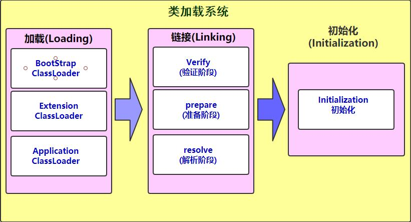

## 类加载过程

#### 一、类加载流程
类加载分为 `加载` `验证` `准备` `解析` `初始化` 五个过程,其中 `验证` `准备` `解析`三个阶段合合称为`链接`阶段 
    

1. 加载: 将类的字节码文件从本地或网络中加载到内存中
    - 将.class文件加载到内存中,将其放在运行时数据区的方法区中,并且在内存中的堆区创建一个java.lang.Class的字节码对象.类加载器并不是在每个类在初次使用时才加载它,JVM允许在预料到某个类将要使用它的时候就将它加载到内存中,而如果在加载过程中遇到文件缺失或者不符合jvm规范,那么它会在使用的时候才抛出错误.即如果一个类在加载时出现错误,但是在程序运行中它没有被使用,那么就不会出错.     
    
2. 验证: 验证加载进来的字节码文件是否合法,比如是否是以制定符号作为开头,是否符合jvm虚规范等.验证主要分为4个部分,分别是文件格式验证,元数据验证,字节码验证,符号引用验证.
    - 文件格式验证: 验证字节流是否符合.class字节码文件规范,并且能被当前虚拟机识别,验证成功后会将字节码加载到方法区中.
    - 元数据验证: 对类的元数据进行语义校验,保证不存在不符合java语法规范的元数据
    - 字节码验证: 该阶段主要是对数据流和控制流进行校验,保证类在运行时不会对虚拟机产生伤害.
    - 符号引用校验: 类自身以外的信息（常量池中的各种符号引用）进行匹配性的校验。
    
3. 准备: 给类中的静态变量分配内存空间.
    - 在准备阶段,jvm会为类中的静态变量尽心初始化赋值(0,0L,false等),该阶段不会执行对变量的显式赋值,如 `static int i = 1` ,在这个阶段只会对变量i进行初始化赋值为0.并且这里只会对静态变量赋值,实例变量会在创建对象时随着对象一起分配到堆内存中.

4. 解析: 将符号引用解析为直接引用
    - 解析阶段是虚拟机将常量池内的符号引用替换为直接引用的过程。
    - 符号引用: 字符串引用,根据该引用能找到对应的本地数据
    - 直接引用: 将数据加载到内存中后的内存地址
    - 如 `StringBuilder sb = new java,lang.Stringbuilder()`, 这里在内加载解析阶段之前是通过符号引用指向对应的本地类,符号引用是将类加载到内存中后指向其在内存中的内存地址.

5. 初始化: 对类的静态变量,静态代码块进行初始化操作
    - 初始化阶段用来对类中的静态属性进行赋值,主要有两种方式
        1. 声明变量的时候直接赋值
        2. 通过静态代码块进行赋值
    - 初始化阶段会执行类构造器方法(不是类的构造方法!!),在idea中安装  `jclasslib`可以查看类的构造器方法(`Methods -> <clinit>`). 类构造器方法是编译器自动收集类中的所有静态变量和静态代码块合并产生的,编译收集的顺序是由语句的书写顺序决定的.
    - 类构造器方法和构造方法不同的是他不需要显示调用父类的类构造器方法,虚拟机会保证在子类的类构造器方法执行完之前先执行父类的类构造器方法,即在虚拟机中执行的第一个类构造器方法一定是 `Object`的类构造器方法.
    - 由于父类的类构造器方法一定先于子类的类构造器方法执行,所以就意味着父类的静态属性要比子类的静态属性先执行赋值操作.
    - 类构造器方法不是必须的,一个类如果没有静态属性,那么它可以没有类构造器方法.
    - 接口中也会存在变量赋值的操作,但是与类不同的是接口的构造器方法执行之前不需要执行父接口的构造器方法,只有当父接口的属性被使用的时候才会执行父接口的类构造器方法.
    - 虚拟机会保证一个类的构造器方法在多线程的环境中被正确的执行,如果多个线程同时初始化一个类,那么只有一个线程会执行该类的类构造器方法,其他线程会阻塞在这里,知道活动线程执行类构造器方法完毕.

#### 二、类何时被初始化
java虚拟机规定在以下几种情况下一定会执行类的初始化
1. 创建类的实例
2. 访问类的静态变量；
3. 访问类的静态方法；
4. 反射使用类(Class.forName(java.lang.String))
5. 当一个类的子类被初始化并且使用的时候
6. 虚拟机启动的时候,定义了main()方法的那个类会被初始化

 

