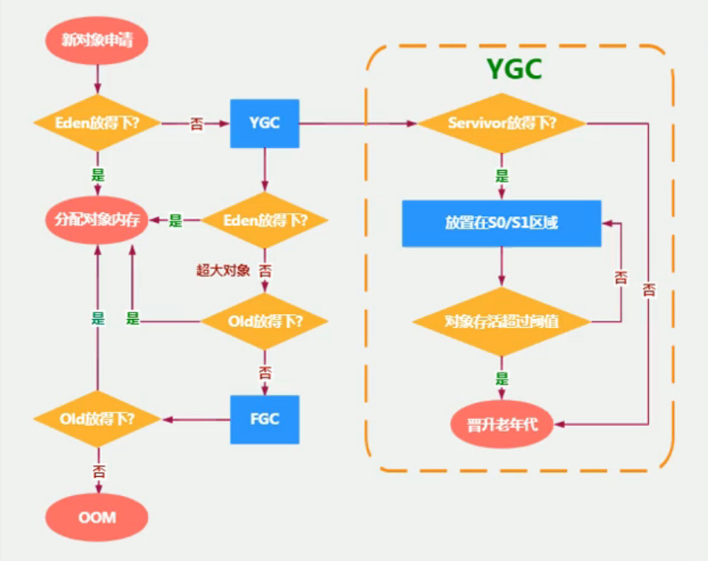
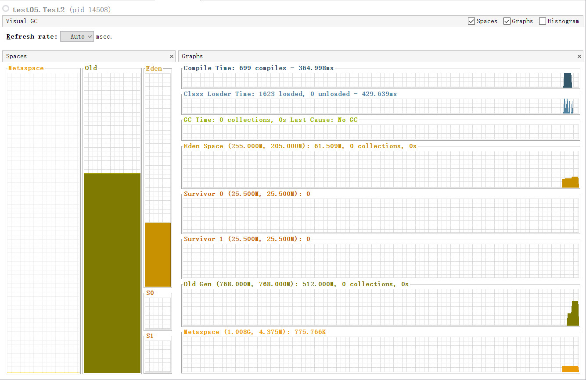

## 一、HotSpot虚拟机堆分代策略

1. 现代垃圾收集器基本上都是基于堆分代收集理论设计，主要将堆空间分为如下区块：
    - java 7及以前主要将堆分为 `新生代(Young Generation Space)`、`老年代(Tenure Generation Space)`、`永久代(Permanent Space)`三个区域, 其中新生代又分为 `伊甸园区(Eden)`、`Survivor 0区(From)`、`Survivor 1区(To)`；这里两个Survivor区中始终有一个是空的，一般规定谁空谁就是To区，非空的就是From区。
    
    - java 8后在内存逻辑上`取消了老年代`而使用`元数据区(MetaData Space)`代替，其他区域和java 7保持不变。

2. 堆空间大小参数设置
    - -Xms 设置堆空间（新生代+老年代）初始内存大小（-Xms256m/-Xms2g）
    - -Xmx 设置堆空间（新生代+老年代）最大内存大小（-Xmx256m/-Xmx2g）
    - -XX:NewRatio=2 设置新生代/老年代的大小比例，2表示老年代为新生代的2倍，即整个堆内存中，新生代占1/3，老年代占2/3。当修改为-XX:NewRatio=4时，表示新生代占1，老年代占4。
    - -XX:SurvivorRatio: 设置新生代中伊甸园区与Survivor区的比例，如设置-XX:SurvivorRatio=8表示伊甸园区占新生代整体比例的80%， 余下20%由两个Survivor区对半分，即此时新生代区域比例为8：1：1

3. 堆空间默认大小
    - 初始内存： 电脑物理内存/64
    - 最大内存： 电脑物理内存/4

4. 在java中，几乎所有的对象都是在伊甸园区（Eden）被new出来的，但是存在部分大对象会被直接放在老年代中。
    
    - 在上图中可以看出，当堆中各区块内存大小充足时，new一个对象时会直接在伊甸园区中为其分配一块内存空间。
    - 当伊甸园区空间不足时，会先进行一次Young GC。执行完GC后此时的伊甸园区是空的，再次尝试将对象放在伊甸园区，如果还是放不下去就会将其放在老年代中。
    - 当对象分配到老年代时，如果老年代空间足够，就会在其中为其分配内存空间，如果老年代空间不够为其分配空间，就会报OOM错误。

    - 这里在测试的时候发现当伊甸园区不够为一个对象分配内存时，并没有触发Young GC,而是直接将其分配到老年代中。测试代码如下： 
        ```java
        //JVM设置参数： -Xmx1g -Xms1g -XX:NewRatio=3 -XX:SurvivorRatio=8
        public class Test2 {
            public static void main(String[] args) throws       InterruptedException {
                Thread.sleep(10000);
                byte[] b = new byte[1024 * 1024 * 256];
                Thread.sleep(5000);
                byte[] b2 = new byte[1024 * 1024 * 256];
            }
        }
        ```
        JvisualVM信息如下: 从图中可以看出From和To区都是空的，说明JVM没有执行GC，并且上面的GC Time栏显示信息也是0，即当创建一个伊甸园区放不下的大对象时，会将其直接分配到老年代，并且此时并没有执行垃圾回收。
        
