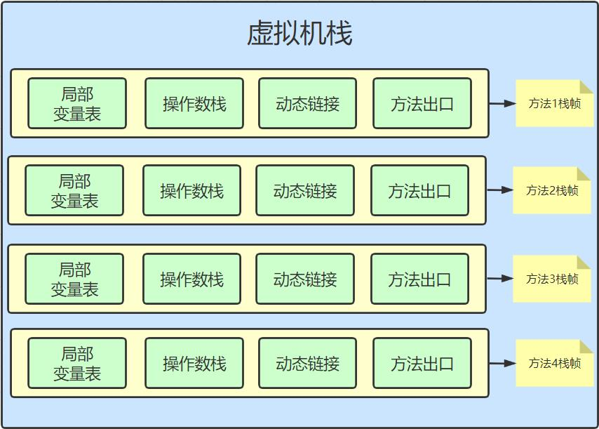

## 虚拟机栈
1. 虚拟机栈
    - 在jvm中,每个线程都有属于自己的栈空间(虚拟机栈). 虚拟机栈保存了当前线程运行时的数据信息,属于线程私有空间,生命周期与线程相同.
    - 虚拟机栈描述的是java方法执行的内存模型,每个方法在执行的时候都会创建一个栈帧用于存储局部表量表、操作数栈、动态链接、方法出口等信息。
    

2. 运行原理
    - JVM对虚拟机栈的操作就两个,即对栈帧的压栈(入栈\push())和弹栈(出栈\pop()).栈内存遵循`先进后出`的原则.

    - 在一个活动线程上,同一时间点只会有一个活动的栈帧.即当前正在执行的方法的栈帧是有效的,这个栈帧被称为`当前栈帧`(Current Frame).,与当前栈帧对应的是`当前方法`(Current Method),定义这个方法的类就是`当前类`(Current Class).

    - 如果在一个类中调用了另一个类,那么新调用的类对应的栈帧就会被创建出来放在栈顶,并且取代调用者成为新的`当前栈帧`.