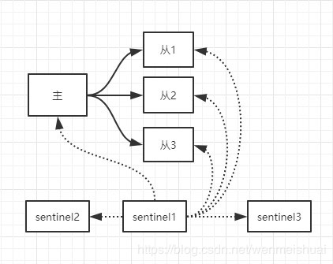
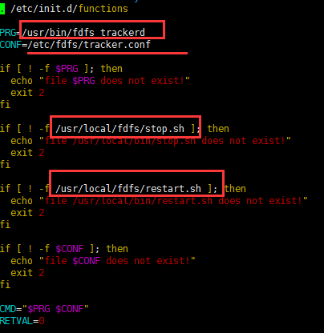
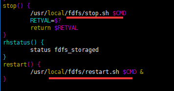
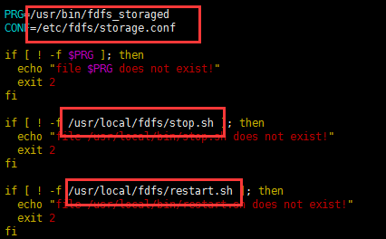
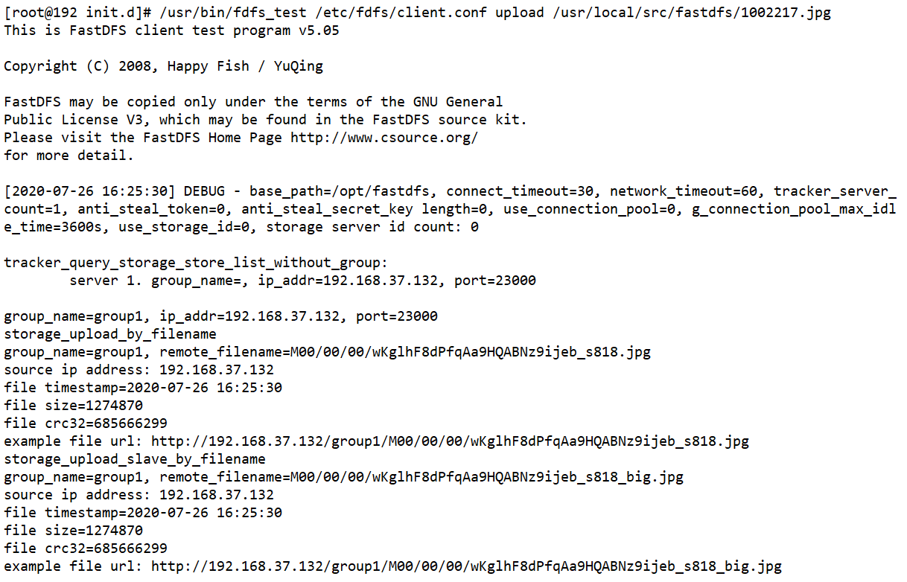
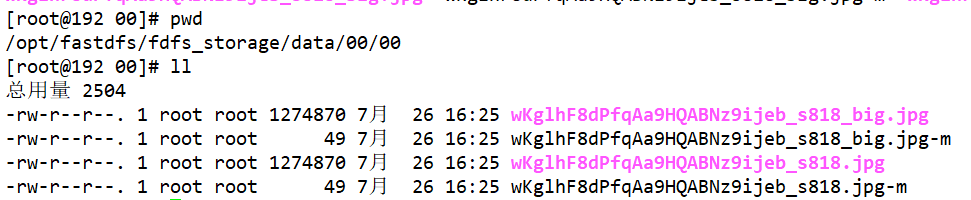
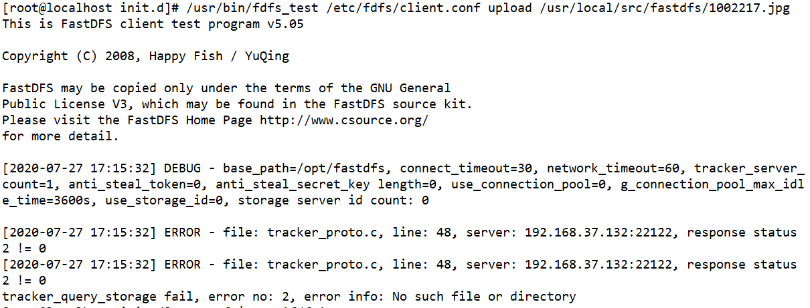

## 一、安装net-tools
1. 启动初始化的虚拟机后运行`ifconfig`显示 `command not found`
2. 在 `/sbin`目录下运行 `ls | grep 'if'` 结果中没有 `ifconfig`命令
3. 运行 `yum install net-tools`，安装中询问时选择`y`;
4. 安装完成后再次运行 `ifconfig` 正常显示IP信息

## 二、安装java
1. 将下载好的Linux版JDK上传到 `/usr/local/src`
2. 新建安装目录 `mkdir /usr/local/java`
3. 将java文件解压到上面的目录中 `tar -xvf jdk-8u51-linux-x64.tar.gz -C /usr/local/java`
4. 添加环境变量,编辑配置文件并在末尾添加如下代码 `vim /etc/profile`
    ```shell script
    export JAVA_HOME=/usr/local/java/jdk1.8.0_51
    export JRE_HOME=${JAVA_HOME}/jre
    export CLASSPATH=.:${JAVA_HOME}/lib:${JRE_HOME}/lib
    export PATH=${JAVA_HOME}/bin:$PATH
    ```
5. 刷新配置文件 `source /etc/profile`
6. 验证 `java -version`

## 三、安装Tomcat配置,dubbo-admin
1. 将 `tomcat`、`dobbo-admin`上传到`/usr/local/src`
2. 创建目录 `mkdir /usr/local/tomcat`和`mkdir /opt/dubbo`
3. 将tomcat解压到上面创建的目录`tar -xvf apache-tomcat-8.5.57.tar.gz -C /usr/local/tomcat`
4. 将`dubbo-admin`解压到 `/opt/dubbo`
5. 进入`tomcat`的`conf`目录并编辑 `server.xml`文件
6. 在 `</Host>`标签上一行添加如下标签
    ```xml
    <Context path="/dubbo" docBase="/opt/dubbo" debug="0" privileged="true" />
    ```
7. 切换到 `bin`目录下启动tomcat `./startup.sh`
8. 安装`zookeeper`,上传`zookeeper`到服务器
9. 在`/opt`创建`/opt/zookeeper-3.4.14/data`作为数据目录
10. 解压文件到`/opt`进入并修改`conf/zoo.cfg`
    
    - 修改`dataDir=/opt/zookeeper-3.4.14/data` 
11. 进入bin目录,启动`zookeeper` 
    ```shell script
    ./zkServer.sh start
    ./zkServer.sh status
    ```

## 四、关闭防火墙
1. 查看防火墙状态 `Firewall-cmd --state`,显示 `Running`
2. 关闭防火墙 `systemctl stop firewalld.service`
3. 禁止防火墙开机自启动 `systemctl disable firewalld.service`

## 五、安装mysql
1. 原文: [Centos 7 安装 MySQL博客连接](https://www.jianshu.com/p/7cccdaa2d177)
2. 安装`wget` `sudo yum -y install wget`
3. 下载 mysql yum 源 `wget 'https://dev.mysql.com/get/mysql57-community-release-el7-11.noarch.rpm'`
4. 升级RPM包 `sudo rpm -Uvh mysql57-community-release-el7-11.noarch.rpm`
5. 查看可用的mysql `yum repolist all | grep mysql`
6. 安装mysql `sudo yum install mysql-community-server` 
7. 启动mysql服务 
    ```shell script
    sudo service mysqld start 
    sudo systemctl start mysqld
    sudo systemctl status mysqld
    ```
8. 输入`sudo grep 'temporary password' /var/log/mysqld.log`查看初始密码
9. 使用显示的初始密码登陆 `mysql -u root -p`
10. 修改密码为root `ALTER USER 'root'@'localhost' IDENTIFIED BY 'root';`
11. 有时候会报错说密码不符合规范，主要是因为密码设置过于简单，[参考解决方案](https://blog.csdn.net/kuluzs/article/details/51924374)
12. 开启远程访问 `grant all privileges on *.* to 'root' @'%' identified by 'root';`

## 六、安装redis
1. 下载、解压、编译如下
    ```shell script
    $ wget http://download.redis.io/releases/redis-5.0.5.tar.gz
    $ tar xzf redis-5.0.5.tar.gz
    $ cd redis-5.0.5
    $ make
    ```
2. 配置`redis.conf`
    - 去除IP绑定 69行 `# bind 127.0.0.1` 
    - 关闭保护模式 88行 ` protected-mode no`
    - 开启后台启动 136行 `daemonize yes`
3. 启动redis `redis-server redis.conf`
4. 检验是否启动成功 `ps -ef|grep 'redis'`

## 七、redis分片机制
1. 在redis根目录创建 `shards`文件夹
2. 复制3分配置文件并分别修改对应端口
    ```shell script
    cp redis.conf shards/redis-6379.conf
    cp redis.conf shards/redis-6380.conf
    cp redis.conf shards/redis-6381.conf
    ```
3. 启动多台redis
    ```shell script
    redis-server redis-6379.conf
    redis-server redis-6380.conf
    redis-server redis-6381.conf
    ```
## 八、redis主从复制及哨兵机制

1. 在已完成redis分片的前提下执行,将`shards`文件夹重命名为 `sentinel`
2. 启动3台redis
    ```shell script
    redis-server redis-6379.conf
    redis-server redis-6380.conf
    redis-server redis-6381.conf
    ```
3. 配置主从,这里将 `6379`作为主机,其余两台作为从机挂载到`6379`
4. 使用客户端分别连接 `6380`、`6381` 并执行挂载操作，操作如下
    ```shell script
    redis-cli -p 6380
    SLAVEOF 127.0.0.1 6379
    exit
    ```
5. 使用客户端连接 `6379` 查看挂载状态
    ```shell script
    127.0.0.1:6379> info replication
    # Replication
    role:master
    connected_slaves:2
    slave0:ip=192.168.37.132,port=6380,state=online,offset=434,lag=1
    slave1:ip=192.168.37.132,port=6381,state=online,offset=434,lag=0
    master_replid:4e7546ee3a7dd4e808f7feea1083702531699e7c
    master_replid2:0000000000000000000000000000000000000000
    master_repl_offset:434
    second_repl_offset:-1
    repl_backlog_active:1
    repl_backlog_size:1048576
    repl_backlog_first_byte_offset:1
    repl_backlog_histlen:434
    ```
6. 测试,在主机插入一条数据后在从机可以读取到,说明主从同步成功, 然后在从机写入一条数据,显示(error),即从机为只读
    ```shell script
    127.0.0.1:6379> set str 123
    OK
    127.0.0.1:6379> get str
    "123"
    ```
    ```shell script
    127.0.0.1:6380> get str
    "123"
    127.0.0.1:6380> set stre 1234
    (error) READONLY You can't write against a read only replica.
    ```
7. 复制哨兵的配置文件 `cp sentinel.conf sentinel`
8. 编辑哨兵配置文件         
    - 关闭保护模式,去除注释 17行 `protected-mode no`
    - 开启后台启动 26行 `daemonize yes`
    - 修改哨兵监听  84 `sentinel monitor mymaster 127.0.0.1 6379 1`
        - 哨兵默认每隔1秒向节点发送`ping`信息,当收到无效回复时会将服务器认定为主观下线,当主节点出现主观下线时,
        哨兵会询问其他哨兵主节点状态,当确认主节点为主观下线的哨兵达到配置数量时(上面配置的 1,即这里只要有一个哨
        兵认为主节点为主观下线那么该主节点就会被设置为客观下线), 主节点将被修改为客观下线.     
        - 当主节点被客观下线时,哨兵会选举出一位临时的主哨兵(可以是自己选自己),根据选举规则在从节点中选举出一位主
        节点并且将原先的主节点降级为从节点并下线并且将其他从节点指向新选出的主节点进行数据复制.
        - mymaster: 代表主机的变量名    
        - IP端口: 表示真正的主机     
        - 1: 哨兵投票生效的票数  
    - 修改投票时间 113 `sentinel down-after-milliseconds mymaster 10000`
      
        > 10000: 哨兵投票时间,如果一个节点距离上次有效回复ping命令的时间超过这个时间就会被判定为主观下线
    - 修改重选时间 146行 `sentinel failover-timeout mymaster 20000`
      
        > 如果在20秒内没有选举成功则重新选举
9. 启动哨兵 `redis-sentinel sentinel.conf`
10. 宕机测试,将主节点宕机,等待10秒后查看从节点是否选举出新的主节点,再重新启动主节点看是否成功挂载为从节点.

## 九、redis集群
1. 在`redis`根目录创建`cluster`文件夹,添加`7000` ~ `7005`6个子目录
2. 将`redis.conf`复制到`7000`并以原名保存
3. 编辑配置文件
    -注释本地绑定 69行 ` # bind 192.168.37.132`
    -关闭保护模式 88行 `protected-mode no`
    -修改端口号 92行 `port 7000`
    -开启后台启动 136行 `daemonize yes`
    -修改pid文件 158行 `pidfile /usr/local/redis/cluster/7000/redis.pid`
    -修改持久化路径 263行 `dir /usr/local/redis/cluster/7000`
    -设置内存优化策略 597行 `maxmemory-policy volatile-lru`
    -关闭AOF模式 699行 `appendonly no`
    -开启集群配置 832行 `cluster-enabled yes`
    -开启集群配置文件 840行 `cluster-config-file nodes.conf`
    -修改集群超时时间 846行 `cluster-node-timeout 15000`
4. 将修改后的配置文件分别复制到其他5个端口对应的目录并且将配置文件中的`7000`改为目录对应的端口号
    ```shell script
    vim 7001/redis.conf
    :%s/7000/7001/g
    :wq
    ```
5. 创建启动脚本 `vim start.sh`
    ```shell script
    #!/usr/bin/sh
    redis-server 7000/redis.conf &
    redis-server 7001/redis.conf &
    redis-server 7002/redis.conf &
    redis-server 7003/redis.conf &
    redis-server 7004/redis.conf &
    redis-server 7005/redis.conf &
    ```
6. 创建关闭脚本 `vim shutdown.sh`
    ```shell script
    #!/usr/bin/sh
    redis-cli -h 127.0.0.1 -p 7000 shutdown &
    redis-cli -h 127.0.0.1 -p 7001 shutdown &
    redis-cli -h 127.0.0.1 -p 7002 shutdown &
    redis-cli -h 127.0.0.1 -p 7003 shutdown &
    redis-cli -h 127.0.0.1 -p 7004 shutdown &
    redis-cli -h 127.0.0.1 -p 7005 shutdown &
    ```
7. 启动redis节点
    ```shell script
    sh ./start.sh
    ```
8. 创建Redis集群
    ```shell script
    redis-cli --cluster create --cluster-replicas 1 127.0.0.1:7000 127.0.0.1:7001 127.0.0.1:7002 127.0.0.1:7003 127.0.0.1:7004 127.0.0.1:7005
    ```
9. 集群测试     
    - 关闭redis主机.检查是否自动实现故障迁移.
    - 再次启动关闭的主机.检查是否能够实现自动的挂载.
    
## 十、安装nginx
1. 上传`nginx`到`/usr/local/src`目录下
2. 解压`nginx`到`/usr/local`
3. 进入解压后的目录配置安装路径
4. 编译安装
5. 验证
```shell script
# 解压
tar -xvf nginx-1.16.1.tag.gz -C /usr/local
cd /usr/local/nginx-1.16.1
# 配置路径
./configure --prefix=/usr/local/nginx
编译安装
make
make install
# 验证
../nginx/sbin/nginx -v
```

## 十一、分布式文件存储（fastdfs）
1. 安装依赖软件和类库
    ```shell script
    yum install gcc-c++ -y
    yum -y install zlib zlib-devel pcre pcre-devel gcc gcc-c++ openssl openssl-devel libevent libevent-devel perl unzip net-tools wget
    yum -y install libevent
    yum install perl*
    ```
   
2. 安装`fastdfs`依赖库`Libfastcommon`,使用版本`1.0.7`
    - 首先上传依赖文件到/opt并解压
    ```shell script
    cd /opt/libfastcommon-1.0.7/
    ./make.sh
    ./make.sh install
    cp /usr/lib64/libfastcommon.so /usr/lib
    ```
   
3. 安装`fastdfs`软件,使用版本`FastDFS_v5.05.tar.gz`
    - 新建目录用于存放软件数据和日志 `mkdir /opt/fastdfs`
    - 解压`FastDFS_v5.05.tar.gz`到`/usr/local`
    - 进入解压后的目录,执行编译安装 `./make.sh` `./make.sh install`
    - 进入`./conf`目录下将全部文件复制到`/etc/fdfs`
    - 进入`/etc/fdfs`目录下配置`tracker.conf`  
      
        - 设置软件数据和日志目录  22行 `base_path=/opt/fastdfs`
    - 进入`/etc/fdfs`目录下配置`storage.conf`
        - 设置软件数据和日志目录  41 `base_path=/opt/fastdfs`
        - 设置trackerIp  118行 `tracker_server=192.168.37.132:22122`
        - 设置存储文件的目录  109行 `store_path0=/opt/fastdfs/fdfs_storage`
    - 配置`tracker`和`storage`的启动服务
        - 创建目录 `/usr/local/fdfs`
        - 进入`/etc/init.d`目录
        - 编辑`trackerd`脚本    
            
            
        - 进入安装目录/usr/local/FastDfs并将相关脚本复制到`fdfs`目录
            ```shell script
            cp restart.sh  /usr/local/fdfs/
            cp stop.sh  /usr/local/fdfs/
            ```
        - 编辑`trackerd`脚本    
            
            
    - 将启动脚本加入Linux服务
        ```shell script
        cd /etc/init.d
        chkconfig --add fdfs_trackerd
        chkconfig --add fdfs_storaged
        ```
    - 启动服务 
        ```shell script
        service fast_trackerd start
        service fast_storaged start
        ```
      启动失败的话可以使用下面的方法:
        ```shell script
        cd /etc/init.d
        ./fast_trackerd start
        ./fast_storaged start
        ```
    
4. 上传图片测试
    - 编辑`/etc/fdfs/client.conf`
        - 修改测试数据目录 10行 `base_path=/opt/fastdfs`
        - 修改`tracker_server`的IP地址 14行 `tracker_server=192.168.37.132:22122`
    - 测试
    ```shell script
    # 使用 client.conf 配置文件测试上传,将/opt下的 1.jpg 上传到服务器 
    /usr/bin/fdfs_test /etc/fdfs/client.conf upload /opt/1.jpg
    ```
   - 返回信息
   
   - 在 `/opt/fastdfs/fdfs_storage/data/00/00`查看上传后的图片
   

5. 问题及修复
    - 在之前上传成功后将虚拟机设置为`挂起`状态,第二天再次测试上传时报错,截图如下
    
    - 切换到数据存储目录查看日志 
        ```shell script
        cd /opt/fastdfs/logs/
        cat storaged.log |more
        ```
    - 显示结果如下
        ```shell script
        ERROR - file: sockopt.c, line: 770, bind port 23000 failed, errno: 98, error info: Address already in use.
        ```
    - 重新启动 `trackerd` 和 `storaged`,使用`ps -ef|grep 'fdfs'`查看进程,杀死`client.conf`,再次测试上传成功.

6. 安装nginx整合插件
    - 将 `fastdfs-nginx-module_v1.16.tar.gz`上传到服务器并解压到`/usr/local`
    - 编辑`/usr/local/fastdfs-nginx-module/src/config`删除第四行路径中的两个`local`
    - 将`/usr/local/fastdfs-nginx-module/src/mod_fastdfs.conf`复制到`/etc/fdfs`
    - 编辑复制后的文件`vim /fdfs/mod_fastdfs.conf`
        - 修改数据目录 10行 `base_path=/opt/fastdfs`
        - 修改`tracher_server`地址 40行 `tracker_server=192.168.37.132:22122`
        - 开启url中的`group`字段 53行 `url_have_group_name = true`
        - 修改数据目录 62行 `store_path0=/opt/fastdfs/fdfs_storage`
    - 将`libfdfsclient.so`拷贝到`/usr/lib`
        - `cp /usr/lib64/libfdfsclient.so /usr/lib/`

7. 整合nginx
    - 编辑`nginx.conf`文件`vim /usr/local/nginx/conf/nginx.conf`
        - 修改监听80端口的`server_name`为`192.168.37.132`
        - 添加下面的代理
        ```shell script
         location /group1/M00/ {
             ngx_fastdfs_module;
         }
        ```
    - 启动nginx报错如下:
      
        - `nginx: [emerg] unknown directive "ngx_fastdfs_module" in /usr/local/nginx/conf/nginx.conf:49`
    - 这是因为我们之前安装nginx时没有添加`ngx_fastdfs_module`插件,解决方案如下
        - 进入`nginx`安装目录下的`sbin`执行`./nginx -V` 查看已安装的插件,打印信息如下       
            `configure arguments: --prefix=/usr/local/nginx`
        - 进入nginx的解压目录依次执行:   
            ```shell script
            ./configure --prefix=/usr/local/nginx --add-module=/usr/local/fastdfs-nginx-module/src
            make
            ```
        - 编译完后会在当前目录生成一个`objs`目录,将原先的`sbin`目录下的`nginx`文件备份并用`objs`下的`nginx`替换`sbin`下的`nginx`
            ```shell script
            cd ./objs
            cp /usr/local/nginx/sbin/nginx /usr/local/nginx/sbin/nginx.bak
            cp ./nginx /usr/local/nginx/sbin
            ```
        - 重启`nginx`
            ```shell script
            /usr/local/nginx/sbin/nginx -s reload
            ```
    - 测试上传及调用
        - 上传
        ```shell script
            /usr/bin/fdfs_test /etc/fdfs/client.conf upload /usr/local/src/fastdfs/1002217.jpg
        ```
        - 在主机调用
         

## 十二、安装elasticsearch     
1. 上传并解压
   
- 上传`elasticsearch`到`/opt/es`并解压
  
2. 编辑配置
    - 编辑es配置文件` vim /opt/es/elasticsearch-6.3.1/config/elasticsearch.yml`
        - 配置es的访问地址 55行 `network.host: 192.168.37.132`
        - 配置es的访问端口 59行 `http.port: 9200`
    - 编辑jvm配置文件 `vim /opt/es/elasticsearch-6.3.1/config/jvm.options`
      
        - 配置堆内存大小 22行 `-Xms4g` 23行 `-Xmx4g`
    - 修改linux的limits配置文件，设置内存线程和文件 `vim /etc/security/limits.conf` 空白处新增如下代码:
        ```shell script
          * hard nofile 65536
          * soft nofile 131072
          * hard nproc 4096
          * hard nproc 2048
        ```
    - 修改linux的sysctl配置文件，配置系统使用内存 `vim /etc/sysctl.conf`, 空白处新增如下代码
        ```shell script
          vm.max_map_count = 655360
          fs.file-max=655360
        ```
    ```
    
    ```
    
3. 启动 
    - 自 `elasticsearch 6`开始就不能使用root用户登录,需要先创建一个新用户
        ```shell script
        adduser es
        passwd es
        # 输入密码即可
        su es 
        ```
    - 使用es用户执行启动脚本即可,可能出现的问题参考[elasticsearch安装记录](./es踩坑.md)
        ```shell script
        # 一. 直接启动,会占用一个终端
        ./elasticsearch
        # 二. 后台启动 
        ./elasticsearch -d  
        ```
4. 验证
    - 在终端执行如下操作验证是否启动成功
    ```shell script
     # 输入 
     curl 'http://localhost:9200/?pretty' 
     #  返回
     {
       "name" : "0NdrB30",
       "cluster_name" : "elasticsearch",
       "cluster_uuid" : "xcxAw66JTuO0gcfkaltjGw",
       "version" : {
         "number" : "6.3.1",
         "build_flavor" : "default",
         "build_type" : "tar",
         "build_hash" : "eb782d0",
         "build_date" : "2018-06-29T21:59:26.107521Z",
         "build_snapshot" : false,
         "lucene_version" : "7.3.1",
         "minimum_wire_compatibility_version" : "5.6.0",
         "minimum_index_compatibility_version" : "5.0.0"
       },
       "tagline" : "You Know, for Search"
     }
    ```
   
5. 查看es中有哪些索引
    - 在浏览器地址栏输入 `192.168.37.132:9200/_cat/indices?v` 
    - 返回：`health status index uuid pri rep docs.count docs.deleted store.size pri.store.size`
    
    |health | status | index | uuid | pri | rep | docs.count | docs.deleted | store.size | pri.store.size|
    | --- | --- |--- |--- |--- |--- |--- |--- |--- |--- |
    |green(集群完整) yellow(单点正常、集群不完整) red(单点不正常)|是否能使用|索引名|索引统一编号|主节点几个|从节点几个|文档数|文档被删除了多少|整体占空间大小|主节点占|
    
## 十三、配置kibana
1. 上传kibana到服务器并解压到`/opt/es`目录。

2. 进入解压后的目录并修改配置 `vim /opt/es/kibana-6.3.1-linux-x86_64/config/kibana.yml`
    - 修改第7行 `server.host: "0.0.0.0"`
    - 修改第28行 `elasticsearch.url: "http://192.168.37.132:9200"`
    
3. 启动elasticsearch，启动Kibana。在浏览器访问`192.168.37.132:5601`，在左侧列表中选择`Dev Tools`即可对`elasticsearch`执行操作

## 十四、添加分词器拆件
1. 下载ik分词器，将分词器插件上传并解压到elasticsearch安装目录下的`plugins`目录下即可。

2. 切换到es用户并重启elasticsearch。

3. 注意：elasticsearch会将plugins目录下的每个子目录识别为一个插件，即我们安装插件时只需要使用一层目录即可。

4. ik分词器有两种分词方式，分别是`ik_smart(简易分词)`和`ik_max_word(尽最大可能分词)`
    ```shell script
       # 简易分词
       GET _analyze
       {
         "analyzer": "ik_smart",
         "text": ["但愿人长久"]
       }
       #分词结果
       {
          "tokens": [
            {
              "token": "但愿人长久",
              "start_offset": 0,
              "end_offset": 5,
              "type": "CN_WORD",
              "position": 0
            }
          ]
       }
    ```
    ```shell script
       # 尽最大可能分词
       GET _analyze
       {
         "analyzer": "ik_max_word",
         "text": ["但愿人长久"]
       } 
       # 分词结果
       {
         "tokens": [
           {
             "token": "但愿人长久",
             "start_offset": 0,
             "end_offset": 5,
             "type": "CN_WORD",
             "position": 0
           },
           {
             "token": "但愿",
             "start_offset": 0,
             "end_offset": 2,
             "type": "CN_WORD",
             "position": 1
           },
           {
             "token": "人",
             "start_offset": 2,
             "end_offset": 3,
             "type": "CN_CHAR",
             "position": 2
           },
           {
             "token": "长久",
             "start_offset": 3,
             "end_offset": 5,
             "type": "CN_WORD",
             "position": 3
           }
         ]
       } 
   ```
   
## 十五、es集群配置
1. 对前面的虚拟机进行完整克隆。
2. 启动克隆后的机器，如果虚拟机软件未开启DHCP则需要对其分配IP地址。
3. 配置IP： `cd /etc/sysconfig/network-script/` ，使用`ifconfig`命令查看使用的网卡名称并编辑对应网卡配置数据即可。完成后使用`service network restart`重启网卡。
4. 进入克隆后的机器，编辑elasticsearch配置文件`vim ./config/elasticsearch.yml`
    ```shell script
     #配置集群名称，所有节点必须相同 
     cluster.name: aubin-cluster     
     #节点名称，不能重复。仅仅是描述名称，用于在日志中区分（自定义）
     node.name: els1
     #指定了该节点可能成为 master 节点，还可以是数据节点
     node.master: true
     node.data: true
     # 数据的默认存放路径（自定义）
     path.data: /opt/es/data
     # 日志的默认存放路径 
     path.logs: /opt/es/logs 
     # 当前节点的IP地址 
     network.host: 192.168.0.1 
     # 对外提供服务的端口
     http.port: 9200 
     #9300为集群服务的端口 
     transport.tcp.port: 9300
     # 集群其他节点的IP地址，也可以使用域名，需要各节点能够解析 
     discovery.zen.ping.unicast.hosts: ["192.168.37.132"] 
     # 为了避免脑裂，集群节点数最少为 半数+1
     discovery.zen.minimum_master_nodes: 2 
    ```


​    
​    
​    
​    
​    
​    