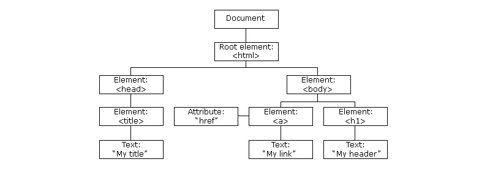

### JSDom


#### 一、html dom

- 当网页被加载时，浏览器会创建页面的文档对象模型（Document Object Model）。

  

- 在js中，我们可以通过`标签名`、`类名`、`id`等属性来查找html元素。大多数时候我们使用`id`来获取。

  ```html
  <body>
      <h4 id="id">hahahaha</h4>
      <button onclick="fun()">按钮</button>
      <script>
          function fun() {
              document.getElementById('id').innerText = "hello";
          }
      </script>
  </body>
  ```

  

#### 二、通过获取dom来修改样式

- 上面演示了通过dom修改标签文本，下面演示修改样式。下面的代码中，点击按钮会修改div的颜色；

  ```html
  <body>
      <h4 id="id">hahahaha</h4>
      <div id="div" style="width: 250px;height: 100px;background-color: red;"></div>
      <p>
          <button id="myBtn" onclick="fun()">按钮</button>
      </p>
  
      <script>
          function fun() {
              document.getElementById("div").style.backgroundColor="green"
          }
      </script>
  </body>
  ```


#### 三、通过dom为元素添加事件监听

- 使用dom获取页面元素之后通过`addEventListener`为元素添加事件。下面的代码在运行之后会为按钮添加一个点击事件，触发后会修改div的颜色。

  ```html
  <body>
      <h4 id="id">hahahaha</h4>
      <div id="div" style="width: 250px;height: 100px;background-color: red;"></div>
      <p>
          <button id="myBtn">按钮</button>
      </p>
  
      <script>
          document.getElementById("myBtn").addEventListener("click", fun)
  
          function fun() {
              document.getElementById("div").style.backgroundColor="green"
          }
      </script>
  </body>
  ```

- 添加事件监听

  我们可以为一个元素添加多个事件监听。这种方式不会覆盖已存在的事件。

  ```html
  <body>
  
  <p>实例使用 addEventListener() 方法在同一个按钮中添加多个事件。</p>
  <button id="myBtn">点我</button>
  <p id="demo"></p>
  <script>
  var x = document.getElementById("myBtn");
  x.addEventListener("mouseover", myFunction);
  x.addEventListener("click", mySecondFunction);
  x.addEventListener("mouseout", myThirdFunction);
  function myFunction() {
      document.getElementById("demo").innerHTML += "Moused over!<br>"
  }
  function mySecondFunction() {
      document.getElementById("demo").innerHTML += "Clicked!<br>"
  }
  function myThirdFunction() {
      document.getElementById("demo").innerHTML += "Moused out!<br>"
  }
  </script>
  
  </body>
  ```

- 向window对象添加事件。

  ```html
  <body>
  
  <p>实例在 window 对象中使用 addEventListener() 方法。</p>
  <p>尝试重置浏览器的窗口触发 "resize" 事件句柄。</p>
  <p id="demo"></p>
  <script>
  window.addEventListener("resize", function(){
      document.getElementById("demo").innerHTML = Math.random();
  });
  </script>
  
  </body>
  ```

- **事件冒泡**和**事件捕获**

  在js中，假设在一个`div`元素中有一个`p`元素，那么当我们为这两个元素绑定点击事件时，就存在一个触发顺序的问题。

  - 事件冒泡：先触发内部元素事件，再触发外部元素事件。即先触发`<p>`标签的事件再触发`<div>`的事件。
  - 事件捕获：先触发外部元素事件，再触发内部元素事件。即先触发`<div>`标签的事件再触发`<p>`的事件。

  ```html
  <body>
      <p>实例演示了在添加不同事件监听时，冒泡与捕获的不同。</p>
      <div id="myDiv">
          <p id="myP">点击段落，我是冒泡。</p>
      </div><br>
      <div id="myDiv2">
          <p id="myP2">点击段落，我是捕获。 </p>
      </div>
      <script>
          document.getElementById("myP").addEventListener("click", function () {
              alert("你点击了 P 元素!");
          }, false);
          document.getElementById("myDiv").addEventListener("click", function () {
              alert(" 你点击了 DIV 元素 !");
          }, false);
          document.getElementById("myP2").addEventListener("click", function () {
              alert("你点击了 P2 元素!");
          }, true);
          document.getElementById("myDiv2").addEventListener("click", function () {
              alert("你点击了 DIV2 元素 !");
          }, true);
      </script>
  </body>
  ```

- 删除事件监听。我们可以使用`removeEventListener`删除前面使用`addEventListener`绑定的事件。

  ```html
  <body>
      <div id="div" style="background-color:red;width:240px;height:100px;padding:40px;">这是一个初始标签</div>
      <p><button onclick="fun()">移除鼠标事件</button></p>
      <script>
          let e = document.getElementById("div");
          e.addEventListener("mouseover", mOver)
          e.addEventListener("mouseout", mOut)
  
          function mOver() { e.innerText = "Thank you" }
          function mOut() { e.innerText = "Mouse Over Me" }
  
          function fun() {
              e.removeEventListener("mouseover", mOver)
              e.removeEventListener("mouseout", mOut)
          }
      </script>
  </body>
  ```


#### 四、Console对象

- 使用console对象可以操作浏览器控制台；

  | 方法                                                         | 描述                                                         |
  | :----------------------------------------------------------- | :----------------------------------------------------------- |
  | [assert()](https://www.runoob.com/jsref/met-console-assert.html) | 如果断言为 false，则在信息到控制台输出错误信息。             |
  | [clear()](https://www.runoob.com/jsref/met-console-clear.html) | 清除控制台上的信息。                                         |
  | [count()](https://www.runoob.com/jsref/met-console-count.html) | 记录 count() 调用次数，一般用于计数。                        |
  | [error()](https://www.runoob.com/jsref/met-console-error.html) | 输出错误信息到控制台                                         |
  | [group()](https://www.runoob.com/jsref/met-console-group.html) | 在控制台创建一个信息分组。 一个完整的信息分组以 console.group() 开始，console.groupEnd() 结束 |
  | [groupCollapsed()](https://www.runoob.com/jsref/met-console-groupcollapsed.html) | 在控制台创建一个信息分组。 类似 console.group() ，但它默认是折叠的。 |
  | [groupEnd()](https://www.runoob.com/jsref/met-console-groupend.html) | 设置当前信息分组结束                                         |
  | [info()](https://www.runoob.com/jsref/met-console-info.html) | 控制台输出一条信息                                           |
  | [log()](https://www.runoob.com/jsref/met-console-log.html)   | 控制台输出一条信息                                           |
  | [table()](https://www.runoob.com/jsref/met-console-table.html) | 以表格形式显示数据                                           |
  | [time()](https://www.runoob.com/jsref/met-console-time.html) | 计时器，开始计时间，与 timeEnd() 联合使用，用于算出一个操作所花费的准确时间。 |
  | [timeEnd()](https://www.runoob.com/jsref/met-console-timeend.html) | 计时结束                                                     |
  | [trace()](https://www.runoob.com/jsref/met-console-trace.html) | 显示当前执行的代码在堆栈中的调用路径。                       |
  | [warn()](https://www.runoob.com/jsref/met-console-warn.html) | 输出警告信息，信息最前面加一个黄色三角，表示警告             |


#### 五、使用dom操作节点

- 节点的**新增**、**删除**、**替换**

  ```html
  
  <body>
      <div id="div" style="width:240px;height:500px;padding:40px;border-style: solid;">
          <p id="init">inner</p>
          <p id="child">inner-child</p>
      </div>
      <p><button onclick="append()">后面添加</button></p>
      <p><button onclick="insert()">前面添加</button></p>
      <p><button onclick="remove()">删除节点</button></p>
      <p><button onclick="replace()">替换节点</button></p>
      <script>
          function append() {
              let p = document.createElement("p");
              let text = document.createTextNode("这是p标签的内容");
  
              p.appendChild(text);
  
              let ele = document.getElementById("div");
              ele.appendChild(p);
          }
  
          function insert() {
              let p = document.createElement("p");
              let text = document.createTextNode("这是p标签的内容");
              p.appendChild(text);
  
              let ele = document.getElementById("div");
              let e = document.getElementById("init");
              ele.insertBefore(p, e);
          }
  
          function remove() {
              let parentElement = document.getElementById("div");
              let childElement = document.getElementById("init");
              parentElement.removeChild(childElement);
          }
  
          function replace() {
              let p = document.createElement("p");
              let text = document.createTextNode("这是替换后的内容");
              p.appendChild(text);
  
              let parentElement = document.getElementById("div");
              let childElement = document.getElementById("child");
              parentElement.replaceChild(p, childElement);
          }
      </script>
  </body>
  ```

  