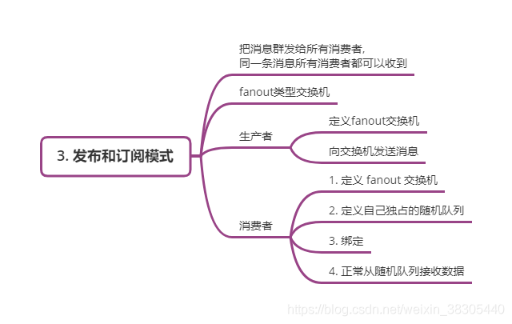
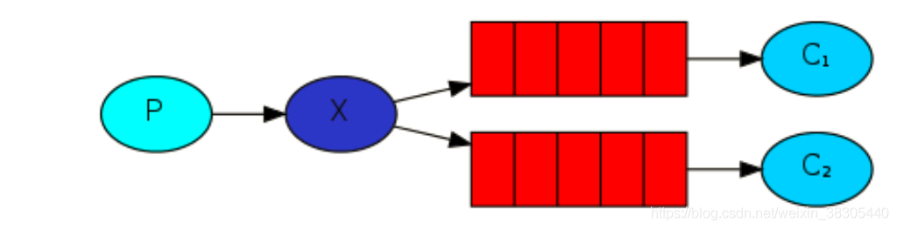
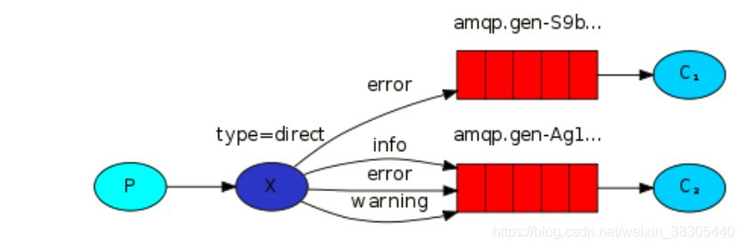

# RabbitMQ安装及使用

## 一、RabbitMQ安装

### 1. 使用docker启动

- 拉取rabbitmq镜像`docker pull rabbitmq:management`，tag为management的版本带有web管理界面
- 通过镜像启动一个容器，`docker run -dit --name Myrabbitmq -e RABBITMQ_DEFAULT_USER=admin -e RABBITMQ_DEFAULT_PASS=admin -p 15672:15672 -p 5672:5672 rabbitmq:management`
- 在浏览器访问 ` 服务器IP:15672`进入管理界面，用户名密码均为admin


## 二、 RabbitMQ六种工作模式

### 1.  简单模式

#### A.  模式说明

​	简单模式就相当于一个生产者一个消费者，然后在生产者和消费者之间添加了一个队列，生产者把消息放到队列中，消费者从队列中获取消息并做相对应的处理。


#### B. 代码实现

##### 修改pom.xml

```xml
<!-- 添加依赖 -->
<dependency>
    <artifactId>spring-boot-starter-amqp</artifactId>
    <groupId>org.springframework.boot</groupId>
</dependency>
```


##### 修改配置文件

```yaml
#这个配置文件在单机版用不上，在spring-boot整合rabbitmq才起作用
spring:
  rabbitmq:
    host: bailegedu.com	#这里配置MQ的服务器地址
    port: 5672
    username: admin
    password: admin
```

##### 公共类

```java
public class CommonField {
    public static final String RABBIT_MQ_HOST = "bailegedu.com";
    public static final Integer RABBIT_MQ_PORT = 5672;
    public static final String RABBIT_MQ_USERNAME = "admin";
    public static final String RABBIT_MQ_PASSWORD = "admin";
}
```


##### 生产者

```java
public class Producer {

    public static void main(String[] args) throws IOException, TimeoutException, InterruptedException {
        //创建连接工厂并设置连接信息
        ConnectionFactory factory = new ConnectionFactory();
        factory.setHost(CommonField.RABBIT_MQ_HOST);
        factory.setPort(CommonField.RABBIT_MQ_PORT);
        factory.setUsername(CommonField.RABBIT_MQ_USERNAME);
        factory.setPassword(CommonField.RABBIT_MQ_PASSWORD);

        //rabbitmq使用的是nio，
        Connection connection = factory.newConnection();
        //简历信道
        Channel channel = connection.createChannel();

        /*
         * 在rabbitmq中声明一个队列
         *  - queue         队列名称
         *  - durable       是否持久化队列
         *  - exclusive     排他，表示这个队列只有当前连接可用
         *  - autoDelete    当最后一个消费者断开后是否删除队列
         *  - arguments     其他参数
         */
        channel.queueDeclare("hello-world", false, false, false, null);

        for (int i = 0; ; i++) {
            channel.basicPublish("", "hello-world", null, ("这是第" + i + "条消息").getBytes(StandardCharsets.UTF_8));
            System.out.println("消息已发送");
            Thread.sleep(1000);
        }
//        channel.close();
    }
}

```


##### 消费者

```java
public class Consumer {
    public static void main(String[] args) throws IOException, TimeoutException {
        //创建连接工厂并设置连接信息
        ConnectionFactory factory = new ConnectionFactory();
        factory.setHost(CommonField.RABBIT_MQ_HOST);
        factory.setPort(CommonField.RABBIT_MQ_PORT);
        factory.setUsername(CommonField.RABBIT_MQ_USERNAME);
        factory.setPassword(CommonField.RABBIT_MQ_PASSWORD);

        //rabbitmq使用的是nio，
        Connection connection = factory.newConnection();
        //简历信道
        Channel channel = connection.createChannel();

        /*
         * 在rabbitmq中声明一个队列
         *  - queue         队列名称
         *  - durable       是否持久化队列
         *  - exclusive     排他，表示这个队列只有当前连接可用
         *  - autoDelete    当最后一个消费者断开后是否删除队列
         *  - arguments     其他参数
         */
        channel.queueDeclare("hello-world", false, false, false, null);

        DeliverCallback callback = (consumerTag, message) -> {
            String msg = new String(message.getBody(), StandardCharsets.UTF_8);
            System.out.println("consumerTag: " + consumerTag + " == 收到消息： " + msg);
        };

        CancelCallback cancel = System.out::println;

        //这才开启一个消费者，连接到 ‘hello-world’这个队列
        channel.basicConsume("hello-world", true, callback, cancel);
    }

}

/* console:
consumerTag: amq.ctag-3iCIlLoy0iD8urRsuTswMA == 收到消息： 这是第0条消息
consumerTag: amq.ctag-3iCIlLoy0iD8urRsuTswMA == 收到消息： 这是第1条消息
consumerTag: amq.ctag-3iCIlLoy0iD8urRsuTswMA == 收到消息： 这是第2条消息
consumerTag: amq.ctag-3iCIlLoy0iD8urRsuTswMA == 收到消息： 这是第3条消息
consumerTag: amq.ctag-3iCIlLoy0iD8urRsuTswMA == 收到消息： 这是第4条消息
consumerTag: amq.ctag-3iCIlLoy0iD8urRsuTswMA == 收到消息： 这是第5条消息
consumerTag: amq.ctag-3iCIlLoy0iD8urRsuTswMA == 收到消息： 这是第6条消息
......
*/
```


### 2. 工作模式

#### A. 模式说明

工作模式类似于简单模式，只是存在多个消费者从一个中间件中获取消息，并且可以配置负载均衡、分发规则、消息持久化等。在这一模式下，生产者使用默认的交换机，然后配置一个路由规则`routing key`l来指明数据流向哪个队列。注意：这里的队列可以在生产者中声明，也可以在消费者中声明。如果在生产者中声明队列，那么生产者往中间件中发送的消息会通过`routing key`放到队列中，如果是在消费者中声明队列，那么在队列被创建之前生产者发送到交换机的消息都会被丢弃（先启动生产者再启动消费者），如果先启动消费者创建队列再启动生产者往交换机中发给数据，那么数据会根据交换机的`routing key`保存到对应的队列中。


#### B. 代码实现

##### 公共类

```java
public class CommonField {
    public static final String RABBIT_MQ_HOST = "bailegedu.com";
    public static final Integer RABBIT_MQ_PORT = 5672;
    public static final String RABBIT_MQ_USERNAME = "admin";
    public static final String RABBIT_MQ_PASSWORD = "admin";
}
```


##### 生产者

```java
/**
 * rabbitmq 工作模式 生产者
 */
public class Producer {

    public static void main(String[] args) throws IOException, TimeoutException, InterruptedException {
        //创建连接工厂并设置连接信息
        ConnectionFactory factory = new ConnectionFactory();
        factory.setHost(CommonField.RABBIT_MQ_HOST);
        factory.setPort(CommonField.RABBIT_MQ_PORT);
        factory.setUsername(CommonField.RABBIT_MQ_USERNAME);
        factory.setPassword(CommonField.RABBIT_MQ_PASSWORD);

        //rabbitmq使用的是nio，
        Connection connection = factory.newConnection();
        //建立信道
        Channel channel = connection.createChannel();
        /*
         * 在rabbitmq中声明一个队列
         *  - queue         队列名称
         *  - durable       是否持久化队列
         *  - exclusive     排他，表示这个队列只有当前连接可用
         *  - autoDelete    当最后一个消费者断开后是否删除队列
         *  - arguments     其他参数
         */
        channel.queueDeclare("Operating mode", true, false, false, null);

        for (int i = 0; ; i++) {
            String msg = "这是第" + i + "条消息";
            if (i == 50) {
                msg = "Q";
            }
            //发送消息
            channel.basicPublish("", "Operating mode",
                    MessageProperties.PERSISTENT_TEXT_PLAIN, //设置消息持久化
                    msg.getBytes(StandardCharsets.UTF_8));
            System.out.println("第" + i + "条消息已发送");
            Thread.sleep(1000);
        }
//        channel.close();
    }
}
```


##### 消费者

```java
public class Consumer {
    public static void main(String[] args) throws IOException, TimeoutException {
        //创建连接工厂并设置连接信息
        ConnectionFactory factory = new ConnectionFactory();
        factory.setHost(CommonField.RABBIT_MQ_HOST);
        factory.setPort(CommonField.RABBIT_MQ_PORT);
        factory.setUsername(CommonField.RABBIT_MQ_USERNAME);
        factory.setPassword(CommonField.RABBIT_MQ_PASSWORD);

        //rabbitmq使用的是nio，
        Connection connection = factory.newConnection();
        //建立信道
        Channel channel = connection.createChannel();

        /*
         * 在rabbitmq中声明一个队列
         *  - queue         队列名称
         *  - durable       是否持久化队列
         *  - exclusive     排他，表示这个队列只有当前连接可用
         *  - autoDelete    当最后一个消费者断开后是否删除队列
         *  - arguments     其他参数
         */
        channel.queueDeclare("Operating mode", true, false, false, null);

        //设置该消费者一次只接收一条消息
        channel.basicQos(1);

        DeliverCallback callback = (consumerTag, message) -> {
            String msg = new String(message.getBody(), StandardCharsets.UTF_8);
            //这里当确认接收的消息是`Q`的时候就结束程序运行，那么Q这一条消息会被生产者回收然后发送给其他的消费者处理
            //我们可以等这个消费者结束后在重新启动一个没有做校验的消费者，如果新的消费者接收到了Q这一条消息，就说明消息确认机制工作正常
            if ("Q".equals(msg)) {
                System.exit(0);
            }
            System.out.println("consumerTag: " + consumerTag + " == 收到消息： " + msg);
            //消息确认，false表示只向中间件确认这一条消息已经处理完毕
            channel.basicAck(message.getEnvelope().getDeliveryTag(), false);
        };
        CancelCallback cancel = System.out::println;
        
        //这才开启一个消费者，连接到 ‘Operating mode’这个队列
        //把自动消息确认关闭掉 autoAck = false表示关掉自动确认
        channel.basicConsume("Operating mode", false, callback, cancel);
    }
}

```

#### C. 消息确认

在上面的代码中，我们添加了消息确认机制。因为在消息队列中，如果存在多个消费者接受处理同一个生产者的消息，那么当一个消费者在处理消息的过程中挂掉了，那么这一条数据就没法再去处理。而当我们添加了消息确认机制后，当消费者处理完一条消息后会向队列发送一个消息回执，告诉消息队列这一条消息已经处理完毕，如果再有上述情况，那么消息队列会将处理失败的消息重新分发给其他正常的消费者处理。上述代码中消费者第37、41行分别代表发送消息回执和开启手动消息确认。

#### D. 合理分发

rabbitmq会一次把多条消息发送给一个消费者，这可能会造成有的消费者非常繁忙，有的却在空闲。这里我们可以使用 `channel.basicQos(1); 消费者26行`告诉消息队列一次只向消费者发送一条消息，在确认回执之前不再发送新的消息，而是把消息发送给下一个消费者。

#### E. 消息持久化

当消息队列关闭时，队列中的消息会消失，如果要求不丢失数据，需要把队列和消息都设置为可持久化。执行方式如下：

- 在生产者和消费者中声明队列时设置队列可持久化` channel.queueDeclare("Operating mode", true, false, false, null);` 
- 在生产者发送消息时设置消息可持久化`channel.basicPublish("", "Operating mode",
                      MessageProperties.PERSISTENT_TEXT_PLAIN, //设置消息持久化
                      msg.getBytes(StandardCharsets.UTF_8));`

### 3. 发布订阅模式

#### A. 模式说明

前面我们使用工作模式实现了消息分发，在上面的例子中，一条消息值发送给一个进程，而如果我们想要把一个消息发送给多个消费者，就需要用到发布订阅模式。在发布订阅模式中，每一个消费者都能完整的接收到它启动后消息队列发送的消息。在发布订阅模式中，生产者会声明一个交换机并制定名字和类型`channel.exchangeDeclare("logs", "fanout");`然后往这个交换机里面放数据，每一个消费者都会声明一个自己的队列`String queue = channel.queueDeclare().getQueue();`然后将队列绑定到交换机上`channel.queueBind(queue, "logs", "");` 通过这种方式再获取交换机中的数据。

#### B.代码实现

##### 公共类

```java
public class CommonField {
    public static final String RABBIT_MQ_HOST = "bailegedu.com";
    public static final Integer RABBIT_MQ_PORT = 5672;
    public static final String RABBIT_MQ_USERNAME = "admin";
    public static final String RABBIT_MQ_PASSWORD = "admin";
}
```


##### 生产者

```java
public class Producer {
    public static void main(String[] args) throws IOException, TimeoutException, InterruptedException {
        ConnectionFactory factory = new ConnectionFactory();
        factory.setHost(CommonField.RABBIT_MQ_HOST);
        factory.setPort(CommonField.RABBIT_MQ_PORT);
        factory.setUsername(CommonField.RABBIT_MQ_USERNAME);
        factory.setPassword(CommonField.RABBIT_MQ_PASSWORD);

        Connection connection = factory.newConnection();
        Channel channel = connection.createChannel();

        //Actively declare a non-autodelete, non-durable exchange with no extra arguments
        //主动声明一个不自动删除、不持久化的五额外参数的交换机
        //logs：交换机名称
        //fanout：交换机类型
        channel.exchangeDeclare("logs", "fanout");

        for (int i = 0; ; i++) {
            //发送消息
            channel.basicPublish("logs", "", null, msg.getBytes(StandardCharsets.UTF_8));
            System.out.println("第" + i + "条消息已发送");
            Thread.sleep(1000);
        }
    }
}
```


##### 消费者

```java
public class Consumer {
    public static void main(String[] args) throws IOException, TimeoutException {
        ConnectionFactory factory = new ConnectionFactory();
        factory.setHost(CommonField.RABBIT_MQ_HOST);
        factory.setPort(CommonField.RABBIT_MQ_PORT);
        factory.setUsername(CommonField.RABBIT_MQ_USERNAME);
        factory.setPassword(CommonField.RABBIT_MQ_PASSWORD);

        Connection connection = factory.newConnection();
        Channel channel = connection.createChannel();

        //Actively declare a non-autodelete, non-durable exchange with no extra arguments
        //主动声明一个不自动删除、不持久化的无额外参数的交换机
        //logs：交换机名称
        //fanout：交换机类型
        // channel.exchangeDeclare("logs", "fanout");

        //Actively declare a server-named exclusive, autodelete, non-durable queue.
        //主动声明一个独占的、自动删除的、不持久化的队列，获取队列名称
        String queue = channel.queueDeclare().getQueue();

        //把该队列绑定到logs交换机
        //对于fanout交换机，routingkey会被忽略，不允许null值
        channel.queueBind(queue, "logs", "");
        DeliverCallback callback = (consumerTag, message) -> {
            System.out.println("consumerTag: " + consumerTag + " == 收到消息： " + (new String(message.getBody(), StandardCharsets.UTF_8)));
        };
        //消费者取消时的回调对象
        CancelCallback cancel = consumerTag -> {
        };
        
        //这才开启一个消费者，连接到queue队列
        channel.basicConsume(queue, true, callback, cancel);
    }
}

```

#### C. 交换机

copy: 

> RabbitMQ消息传递模型的核心思想是，生产者永远不会将任何消息直接发送到队列。实际上，通常生产者甚至不知道消息是否会被传递到任何队列。
>
> 相反，生产者只能向交换机(Exchange)发送消息。交换机是一个非常简单的东西。一边接收来自生产者的消息，另一边将消息推送到队列。交换器必须确切地知道如何处理它接收到的消息。它应该被添加到一个特定的队列中吗?它应该添加到多个队列中吗?或者它应该被丢弃。这些规则由exchange的类型定义。
>
> 有几种可用的交换类型:direct、topic、header和fanout。我们将关注最后一个——fanout。让我们创建一个这种类型的交换机，并称之为 logs: `channel.exchangeDeclare("logs", "fanout");`
>
> fanout交换机非常简单。它只是将接收到的所有消息广播给它所知道的所有队列。这正是我们的日志系统所需要的。
>
> 我们前面使用的队列具有特定的名称(还记得hello和task_queue吗?)能够为队列命名对我们来说至关重要——我们需要将工作进程指向同一个队列,在生产者和消费者之间共享队列。
>
> 但日志记录案例不是这种情况。我们想要接收所有的日志消息，而不仅仅是其中的一部分。我们还只对当前的最新消息感兴趣，而不是旧消息。
>
> 要解决这个问题，我们需要两件事。首先，每当我们连接到Rabbitmq时，我们需要一个新的空队列。为此，我们可以创建一个具有随机名称的队列，或者，更好的方法是让服务器为我们选择一个随机队列名称。其次，一旦断开与使用者的连接，队列就会自动删除。在Java客户端中，当我们不向queueDeclare()提供任何参数时，会创建一个具有生成名称的、非持久的、独占的、自动删除队列
>
> ```
> //自动生成队列名
> //非持久,独占,自动删除
> String queueName = ch.queueDeclare().getQueue();
> ```


### 4. 路由模式

#### A. 模式说明

在前面我们使用Fanout交换机实现了发布订阅模式，在发布订阅模式下，一个生产者推送给交换机的数据可以被转发给多个消费者，每个消费者接收的消息都是完整的。但是有的时候可能某个消费者只需要生产者发送的部分消息，比如说在一个日志系统中，可能存在多个消费者分别用来处理不同级别的日志消息，那么此时我们需要让不同的消费者只接受它需要的日志级别。概念图如下：

在路由模式中，我们需要用到类型为`direct`的直连交换机 `channel.exchangeDeclare("logs_direct", BuiltinExchangeType.DIRECT);`然后根据不同的日志级别为每一条消息设置不同的`routingkey`。再在消费者中声明一个队列并获取队列名`String queue = channel.queueDeclare().getQueue();`，将该队列绑定到生产者中声明的直连交换机上，然后根据消费者业务类型设置不同的`routingkey`。完整代码为：`channel.queueBind(queue, "logs_direct", "error");`。

#### B. 代码实现

##### 公共类

```java
public class CommonField {
    private static final String RABBIT_MQ_HOST = "bailegedu.com";
    private static final Integer RABBIT_MQ_PORT = 5672;
    private static final String RABBIT_MQ_USERNAME = "admin";
    private static final String RABBIT_MQ_PASSWORD = "admin";

    public static Channel getChannel() throws IOException, TimeoutException {
        ConnectionFactory factory = new ConnectionFactory();
        factory.setHost(CommonField.RABBIT_MQ_HOST);
        factory.setPort(CommonField.RABBIT_MQ_PORT);
        factory.setUsername(CommonField.RABBIT_MQ_USERNAME);
        factory.setPassword(CommonField.RABBIT_MQ_PASSWORD);
        Connection connection = factory.newConnection();
        return connection.createChannel();
    }
}
```

##### 生产者

```java
public class Producer {
    public static void main(String[] args) throws IOException, TimeoutException, InterruptedException {
        Channel channel = CommonField.getChannel();
        //声明一个直连交换机，名称为logs_direct
        channel.exchangeDeclare("logs_direct", BuiltinExchangeType.DIRECT);

        String[] logLevel = {"info", "warning", "error"};

        for (int i = 0; ; i++) {
            int index = new Random().nextInt(3);
            String level = logLevel[index];
            String msg = "No. : " + i + " === log-level : " + level;
            //根据日志信息级别为其设置对应的routingkey
            channel.basicPublish("logs_direct", level, null, msg.getBytes(StandardCharsets.UTF_8));
            System.out.println("第 " + i + " 条消息发送成功 ==>" + msg);
            Thread.sleep(1000);
        }
    }
}
```

##### 消费者1

```java
public class ErrorConsumer {
    public static void main(String[] args) throws IOException, TimeoutException {
        Channel channel = CommonField.getChannel();
        //声明一个随机队列并获取队列名
        String queue = channel.queueDeclare().getQueue();
        //将队列绑定到交换机上并设置routingKey为error
        channel.queueBind(queue, "logs_direct", "error");
        //接收消息
        DeliverCallback callback = (consumerTag, message) -> {
            String msg = new String(message.getBody(), StandardCharsets.UTF_8);
            String routingKey = message.getEnvelope().getRoutingKey();
            System.out.println("收到: " + routingKey + " 消息: " + msg);
        };

        CancelCallback cancelCallback = consumerTag -> System.out.println("consumerTag: " + consumerTag);
        // 根据上面的信息创建一个消费者
        channel.basicConsume(queue, true, callback, cancelCallback);
    }
}
```

##### 消费者2

```java
public class OtherConsumer {
    public static void main(String[] args) throws IOException, TimeoutException {
        Channel channel = CommonField.getChannel();
        //声明一个队列并获取队列名
        String queue = channel.queueDeclare().getQueue();
        //将队列绑定到交换机并根据这个队列业务类型接收多个级别的日志
        channel.queueBind(queue, "logs_direct", "info");
        channel.queueBind(queue, "logs_direct", "warning");

        DeliverCallback callback = (consumerTag, message) -> {
            String msg = new String(message.getBody(), StandardCharsets.UTF_8);
            String routingKey = message.getEnvelope().getRoutingKey();
            System.out.println("收到: " + routingKey + " 消息: " + msg);
        };
        CancelCallback cancelCallback = consumerTag -> System.out.println("consumerTag: " + consumerTag);
        channel.basicConsume(queue, true, callback, cancelCallback);
    }
}
```


### 5. 主题模式

#### A. 模式说明

在前面路由模式中，我们实现了让不同的消费者根据其设置的日志级别消费对应的消息。但是在实际中，我们可能还要根据日志源和级别一起决定对应的消费者，这里我们就需要用到主题模式。

在主题模式中，使用了新的交换机Topic。这种交换机的routingkey必须是有`.`分隔开的多个单词，routingkey可以有多个单词，最多255个字节，类似于`oppo.blue.small`。

#### B. 代码实现

### 6. RPC模式


