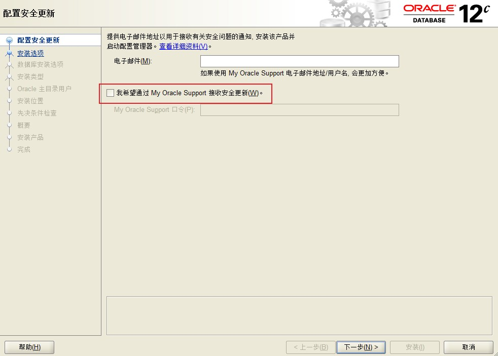
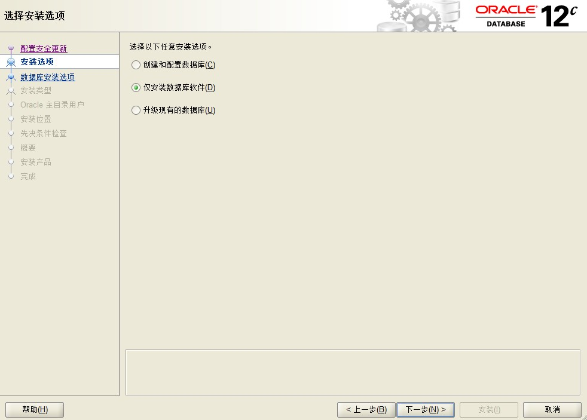
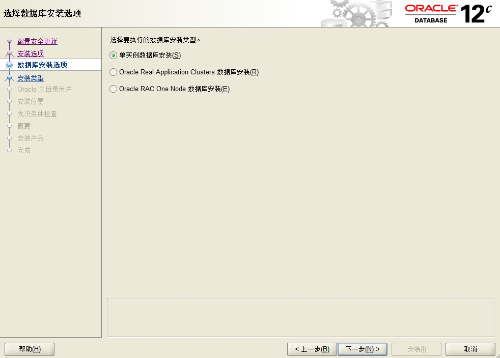
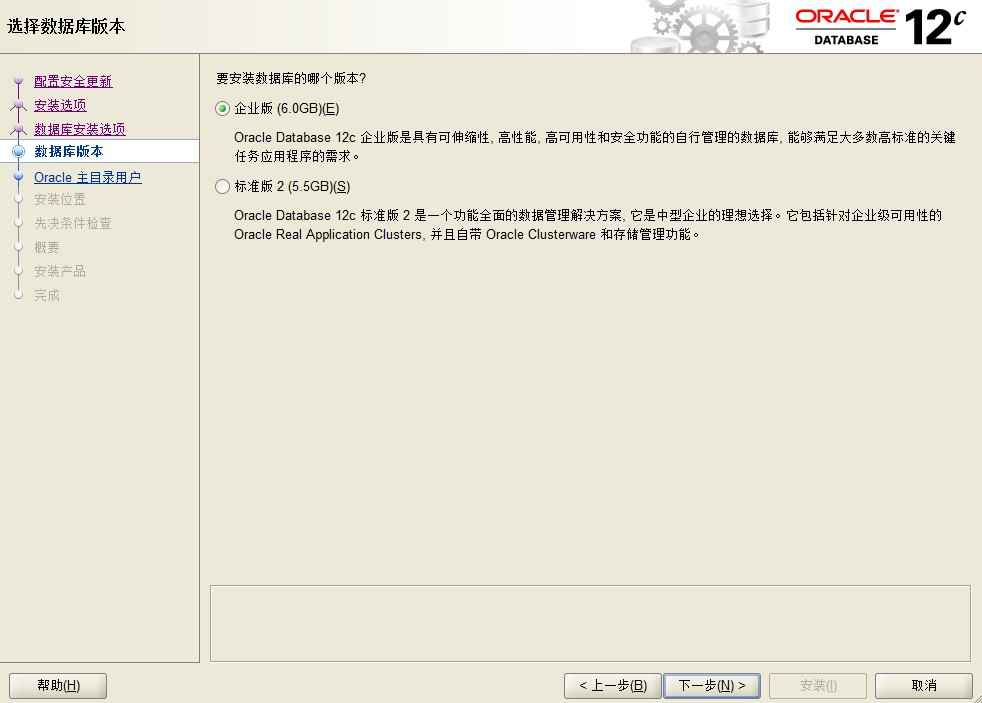
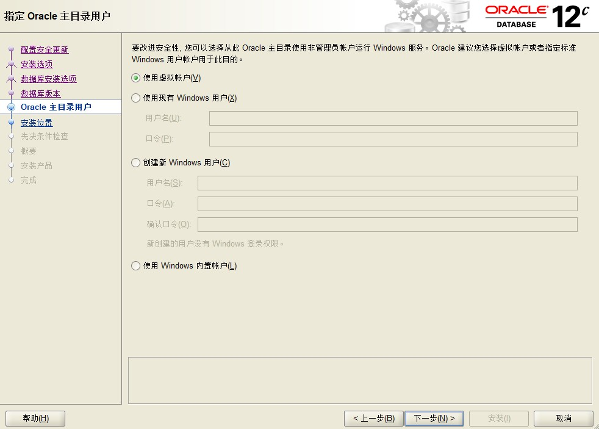
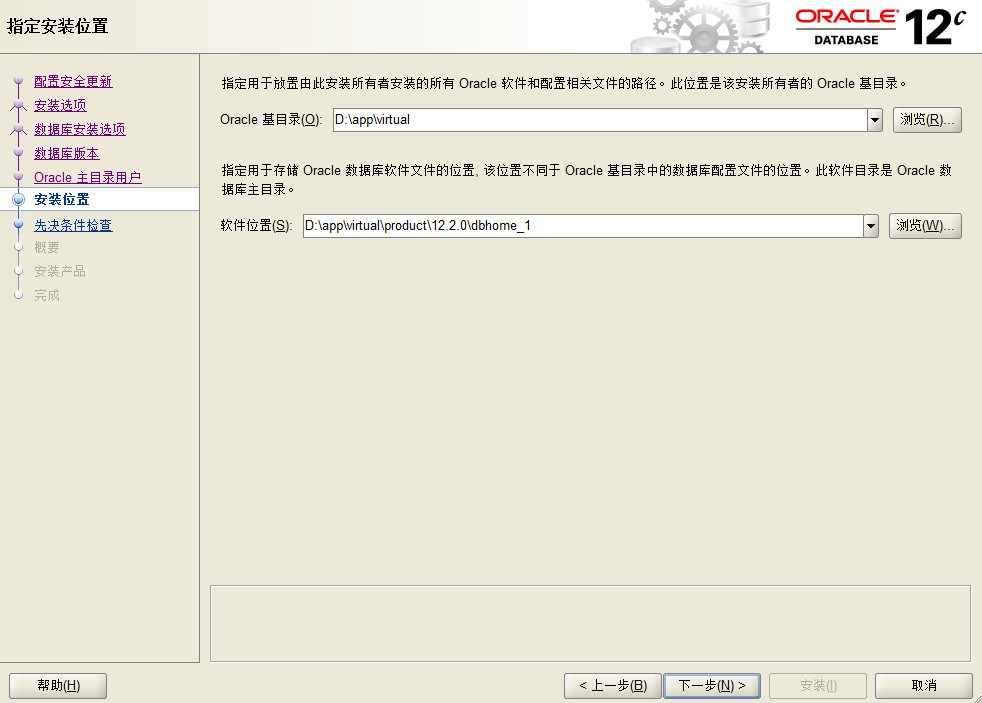
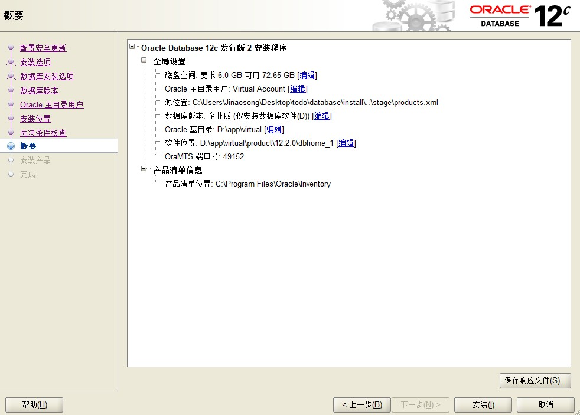
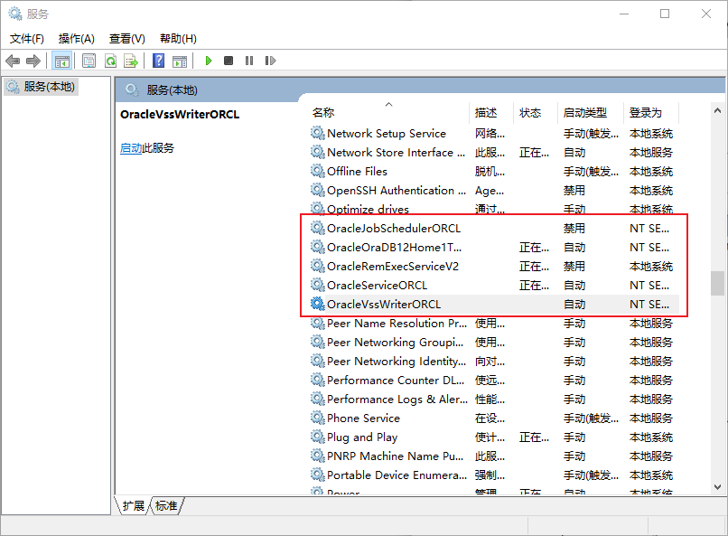

### 一、安装oracle

#### 1. 安装Oracle数据库

- 下载并解压oracle数据库12c版本压缩包并解压，点击setup.exe开始安装
- 取消勾选点击下一步，弹框选是

- 选择仅安装数据库软件，点击下一步

- 选择单实例数据库安装，点击下一步

- 选择企业版，点击下一步

- 选择使用虚拟账户，点击下一步

- 指定安装位置，点击下一步

- 检查先决条件之后自动跳转到概要，在这里会看到相关的安装信息，点击安装开始安装。

- 安装产品步骤耗时较长，耐心等待安装完成即可。

#### 2. 配置oracle数据库

- 

### 二、连接oracle

#### 1.  安装plsql

- 根据实际情况安装plsql即可

#### 2.  配置instantclient

- 下载与`plsql` 版本对应的`instantclient`压缩包

- 打开oracle安装目录找到其中的`product`目录，将压缩包解压至此

- 进入解压后的文件夹中，新建`tnsnames.ora`文件，添加如下内容

  > ORCL =
  >   (DESCRIPTION =
  >     (ADDRESS = (PROTOCOL = TCP)(HOST = localhost)(PORT = 1521))
  >     (CONNECT_DATA =
  >       (SERVER = DEDICATED)
  >       (SERVICE_NAME = orcl)
  >     )
  >   )

- 上面的`host`、`port`、`service_name`根据实际情况配置。

- 配置系统环境变量添加如下内容：

  - 变量名`TNS_ADMIN`，指向instantclient安装目录
  - 变量名`NLS_LANG`，变量值`SIMPLIFIED CHINESE_CHINA.ZHS16GBK`
  - 将instantclient安装目录配置到path变量中

#### 3.  配置plsql

- 打开plsql，在弹出的登录框中选择`取消`进入到plsql主界面。
- 点击主界面最顶部右上角`首选项图标`，在`连接`选项配置`Oracle主目录名`和`oci库`。
  - OCI库配置路径：`{oracle_home}\product\12.2.0\dbhome_1\bin\oci.dll`
- 打开`Oracle net configuration Assistant`配置监听程序
  - 启动程序选择`监听程序配置`，点击下一步
  - 选择`添加`，点击下一步
  - 选择监听名，无特殊需求选择默认
  - 选择协议，默认tcp
  - 选择端口号，默认`1521`
  - 余下步骤默认即可

#### 4. 登录Oracle

- 打开plsql输入用户名密码

- 数据库选择`tnsnames.ora`中配置的属性或按照`ip:port/实例`输入

- 连接为选项选择`normal`

  - normal：普通用户，正常开发选择该项即可
  - sysdba：拥有最高的系统权限
  - sysoper：主要用来启动、关闭数据库

  

### 三、卸载oracle

#### 1. 停止oracle服务

- 使用`win + R`输入`services.msc`关闭所有oracle服务

#### 2. 卸载软件

- 打开开始菜单栏，找到oracle目录中的`Universal Installer`双击运行。
- 打开后选择`卸载产品`，弹框中勾选`Oracle Databases .....`

#### 3. 删除注册表

- 使用`win + R`输入`regedit`打开注册表找到并删除如下信息
  - HKEY_LOCAL_MACHINE\SOFTWARE，
  - HKEY_LOCAL_MACHINE\SYSTEM\ControlSet001\Services，
  - HKEY_LOCAL_MACHINE\SYSTEM\ControlSet001\Services\EventLog\Application， 
  - HKEY_CLASSES_ROOT，

#### 4. 删除文件

- 删除`C:\Program Files\Oracle`
- 删除oracle安装目录
- 删除`C:\Windows\System32\config\systemprofile\Oracle`
- 删除`C:\Users\用户名\oracl`

