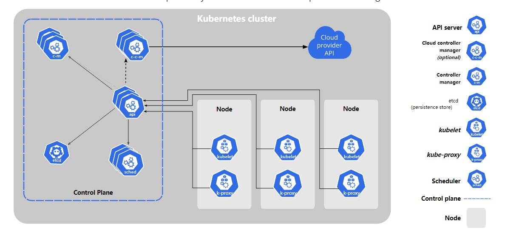

# Kubernetes学习记录

## docker基础

### 安装启动

#### 配置yum源

```shell
yum install -y yum-utils
sudo yum-config-manager \
--add-repo \
http://mirrors.aliyun.com/docker-ce/linux/centos/docker-ce.repo

```

#### yum方式安装docker

```shell
yum install -y docker-ce docker-ce-cli containerd.io
```

#### 启动docker

```shell
systemctl enable docker --now
```

#### 配置加速

```shell
mkdir -p /etc/docker
tee /etc/docker/daemon.json <<-'EOF'
{
  "registry-mirrors": ["{{改成自己的阿里云加速地址}}"],
  "exec-opts": ["native.cgroupdriver=systemd"],
  "log-driver": "json-file",
  "log-opts": {
    "max-size": "100m"
  },
  "storage-driver": "overlay2"
}
EOF
sudo systemctl daemon-reload
sudo systemctl restart docker
```shell

### 基本操作

#### 查找镜像

在[docker hub](https://hub.docker.com/)中找搜索需要下载的镜像。docker镜像为 `[名称]:[版本]`，拉取镜像时也可以不指定版本号。如果不指定具体版本，则会默认下载镜像的最新版本。如果仓库中存在多个版本，则默认下载的是 `latest`标签所对应的版本。但是，需要注意的是，并不是所有的镜像都有 `latest`标签，有些镜像也可能使用其他标签作为默认标签。因此，为了确保下载的是需要的版本，最好还是指定具体的版本号。

#### 常用命令

##### 拉取镜像（pull）

```shell
# 使用pull命令拉取一个镜像
docker pull

# 使用示例：
docker pull nginx
# 或
docker pull redis:7.0.11

# 以上第一种方式没有指定版本，则默认拉取最新版本，第二种方式指定了版本号为7.0.11 
```

##### 查看镜像（images）

```shell
docker images
# 使用docker images命令可以查看当前环境下有哪些docker镜像
```

##### 删除镜像（rmi）

```shell
# docker rmi [OPTIONS] IMAGE [IMAGE...]
docker rmi redis
```

##### 启动容器（run）

```shell
# 使用格式为：
# docker run [OPTIONS] IMAGE [ARG]
docker run --name=myNginx -d --restart=always -p 88:80 nginx
```

- --name 参数用于指定容器名称
- -d 表示该容器启动后在后台运行
- --restart 表示服务重启后容器自动拉起
- -p 表示端口映射，即将容器端口映射到宿主机端口，这里需要两个参数，第一个为宿主机端口，第二个为容器端口，中间用冒号分隔
- -v 目录挂载，跟-p类似，用于将主机中的位置挂载到容器中，用法为 `-v [宿主机目录]:[容器内目录]:[读写权限(ro/rw))]`
  - 读写权限ro表示只读，此时容器内部不能修改挂载的文件，只能在宿主机修改。rw表示读写，宿主机和容器都可以对文件进行修改

```shell
docker run --name="myNginx" -d --restart=always -p 88:80 -v /data/html:/usr/share/nginx/html:ro nginx
# 启动一个nginx容器，容器命名为myNginx，后台运行，宿主机重启后自动拉起，容器端口80映射到宿主机端口88 容器内/usr/share/nginx/html映射到宿主机/data/html且容器内为只读。
```

##### 修改容器参数（update）

```shell
# docker update [OPTIONS] CONTAINER [CONTAINER...]
docker update --restart=no myNginx
# 以上命令为修改myNginx容器为开机后不自动拉起
# update能调整的参数有限，具体可以通过以下命令查看
docker update --help
```

##### 查看容器列表（ps）

```shell
docker ps
```

如果不加任何参数则默认只查看已启动的容器，添加 `-a` 参数则会显示所有容器

```shell
docker ps -a
```

##### 删除容器（rm）

```shell
docker rm [OPTIONS] CONTAINER [CONTAINER...]
docker rm myNginx
# 当容器处于运行状态时无法删除，如果要删除运行中的容器，需要使用
docker rm -f myNginx
```

##### 停止容器（stop）

```shell
# docker stop [OPTIONS] CONTAINER [CONTAINER...]
docker stop myNginx
```

##### 启动容器（start）

```shell
# docker start [OPTIONS] CONTAINER [CONTAINER...]
docker start myNginx
```

##### 进入容器内（exec）

```shell
# docker exec [OPTIONS] CONTAINER COMMAND [ARG...]
docker exec -it myNginx /bin/bash
```

> 在 Docker 容器中执行命令时，通常使用 `docker exec` 命令。`-i` 和 `-t` 选项通常是一起使用的，以打开一个交互式终端会话。
>
> `-i` 选项指示 Docker 容器保持 STDIN 打开，即使容器未附加。这样可以确保在容器中执行命令时，用户输入的数据可以被正确读取。
>
> `-t` 选项分配一个伪终端（pseudo-TTY），这样可以使得在容器中执行命令时，输出的内容能够正确显示。
>
> 通常，如果需要在容器中打开一个交互式会话，则应该同时使用 `-i` 和 `-t` 选项

##### 提交修改（commit）

当我们进入容器内部修改了相关数据之后，需要将改变的东西提交到本地，不然下次如果使用原有镜像启动，则改动会丢失。

```shell
# docker commit [OPTIONS] CONTAINER [REPOSITORY[:TAG]]
docker commit -a "admin" -m "update xxx" myNginx updateNginx:v1.0.1
```

执行以上命令后，会将修改后的容器保存为一个本地镜像，通过 `docker images`可以查看到。后面可以通过运行 `updateNginx:v1.0.1`这个镜像来启动之前修改的内容。

##### 保存镜像（save）

修改后的镜像可以通过save命令导出为tar包在其他环境运行。

```shell
# docker save [OPTIONS] IMAGE [IMAGE...]
# 该命令只有一个可选参数
# -o, --output string   Write to a file, instead of STDOUT
docker save -o myNginx.tar updateNginx:v1.0.1

```

##### 加载镜像（load）

前面保存的镜像可以通过load加载到本地

```shell
# docker load [OPTIONS]
docker load -i myNginx.tar
# 通过以上命令可以将打包的镜像加载到本地镜像列表
```

##### 查看容器日志（logs）

```shell
# docker logs [OPTIONS] CONTAINER
docker logs myNginx
```

##### 文件传送（cp）

```shell
Usage:  docker cp [OPTIONS] CONTAINER:SRC_PATH DEST_PATH|-
        docker cp [OPTIONS] SRC_PATH|- CONTAINER:DEST_PATH
# 这个命令可以实现把文件复制到容器或者将容器内部的文件复制到宿主机
```

- 将宿主机文件复制到容器

```shell
docker cp /data/nginx.conf myNginx:/etc/nginx/nginx.conf
```

- 将容器内的文件复制到宿主机

```shell
docker cp mgNginx:/etc/nginx/nginx.conf /data/nginx.conf
```

## k8s基础概念

### 架构

[[k](https://kubernetes.io/zh-cn/docs/)ubernetes 组件](https://kubernetes.io/zh-cn/docs/concepts/overview/components/)

#### 工作方式

集群方式：N master node + N worker node

即 n个主节点 + n个工作结点， 且 N >= 1

#### k8s组件



##### 集群信息

- control plane : k8s的集群控制中心，包含各种调度控制组件
  - API server
    - 控制中心对结点通信的接口
  - cloud controller manager
  - controller manager
    - 决策者
  - etcd
    - 键值对数据库，用于存储集群数据
  - Scheduler
    - 集群调度
- node：实际工作结点
  - kubelet
    - 每个结点的管理者，控制应用中应用的启停
  - kube-proxy
    - 负责应用的访问，如在多个节点中部署了同一个应用A，此时应用B想要访问应用A，则向kube-proxy查询应用A的位置

##### 集群特点

- 集群内所有组件的交互都是基于 `API server`
- 集群内的网络访问都是通过 `kube-proxy`，各个节点的 `kube-proxy`之间互相同步数据
- 集群内所有数据都需要运行时环境，可以是 `docker`或其他环境
- 集群内每一个节点都需要有一个 `kubelet`


## k8s集群搭建

## k8s核心
