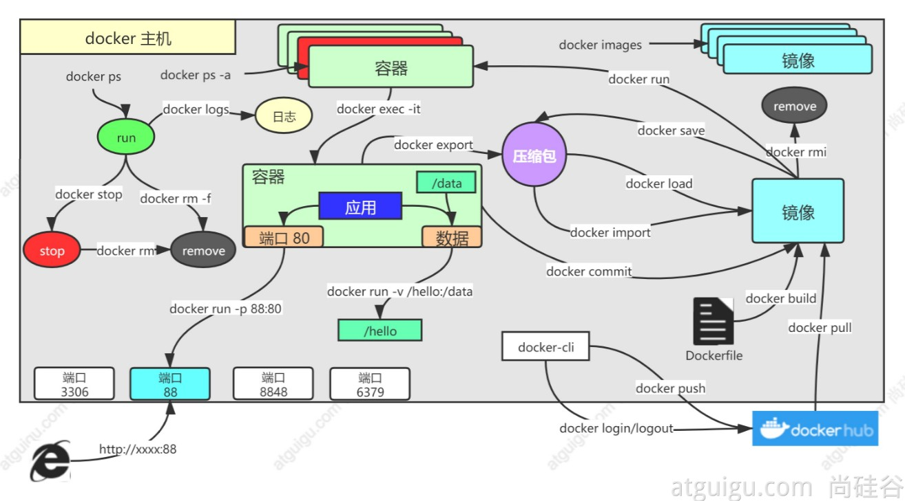

### Docker配置及使用方法



#### 一、Docker基本概念

docker包含三个基本概念，分别为镜像(Image)、容器(Container)、仓库(Repository) [详细信息](https://www.runoob.com/docker/docker-architecture.html)

##### 1. 镜像

- Docker 镜像（Image），就相当于是一个 root 文件系统。比如官方镜像 ubuntu:16.04 就包含了完整的一套 Ubuntu16.04 最小系统的 root 文件系统。

##### 2. 容器

- 镜像（Image）和容器（Container）的关系，就像是面向对象程序设计中的类和实例一样，镜像是静态的定义，容器是镜像运行时的实体。容器可以被创建、启动、停止、删除、暂停等。

##### 3. 仓库

- 仓库可看成一个代码控制中心，用来保存镜像。

#### 二、Docker安装

##### 1. CentOS自动安装

- 配置yum源

```
sudo yum-config-manager \
--add-repo \
http://mirrors.aliyun.com/docker-ce/linux/centos/docker-ce.repo

```

- 更新yum包(测试环境)

```
sudo yum -y update
```

- 卸载旧版本

```
sudo yum remove docker \
                  docker-client \
                  docker-client-latest \
                  docker-common \
                  docker-latest \
                  docker-latest-logrotate \
                  docker-logrotate \
                  docker-engine

```

- 升级安装需要的软件包

```
sudo yum install -y yum-utils device-mapper-persistent-data lvm2
```

- 查看可用的版本

```
sudo yum list docker-ce --showduplicates | sort -r
```

- 安装docker

```
# 默认安装最新版
sudo yum install -y docker-ce docker-ce-cli containerd.io


# 指定安装版本
sudo yum install -y docker-ce-20.10.7 docker-ce-cli-20.10.7  containerd.io-1.4.6
```

- 启动docker

```
sudo systemctl enable docker --now
```

- 配置docker加速

```
sudo mkdir -p /etc/docker
sudo tee /etc/docker/daemon.json <<-'EOF'
{
  "registry-mirrors": [
    "https://registry.docker-cn.com",
    "https://docker.mirrors.ustc.edu.cn"
  ],
  "exec-opts": ["native.cgroupdriver=systemd"],
  "log-driver": "json-file",
  "log-opts": {
    "max-size": "100m"
  },
  "storage-driver": "overlay2"
}
EOF
sudo systemctl daemon-reload
sudo systemctl restart docker
```

##### 2. 启动Docker

- 执行指令 `systemctl start docker --now` 启动docker

##### 3. 验证是否安装成功：

- 运行 `sudo docker run hello-world`，打印如下信息说明安装成功

  ```
  Unable to find image 'hello-world:latest' locally
  latest: Pulling from library/hello-world
  0e03bdcc26d7: Pull complete 
  Digest: sha256:31b9c7d48790f0d8c50ab433d9c3b7e17666d6993084c002c2ff1ca09b96391d
  Status: Downloaded newer image for hello-world:latest

  Hello from Docker!
  This message shows that your installation appears to be working correctly.
  ......
  ```


#### 三、Docker容器基本使用

##### 1. 拉取镜像

- 运行拉取Ubuntu镜像 `docker pull ubuntu`

##### 2. 启动容器

- 运行 `docker run --name=myUbuntu --restart=always -it ubuntu /bin/bash` 使用镜像启动一个容器
  - **docker：** Docker 的二进制执行文件。
  - **run：** 与前面的 docker 组合来运行一个容器。
  - __-i：__ 允许用户对容器内的标准输入进行交互（可以敲命令）
  - **-t：** 在新启动的容器内指定一个终端
  - **/bin/bash**：放在镜像名后的是命令，这里我们希望有个交互式 Shell，因此用的是 /bin/bash
- 运行 `docker run --name=mynginx -d --restart=always -p 80:80 nginx` 启动 nginx
  - --name: 指定容器名称
  - -d 后台运行
  - --restart=always 无论容器的退出状态码是什么，Docker都会自动重启容器。
  - -p 80:80 实现主机-容器的端口映射。格式为 [主机端口]:[容器端口]

##### 3. 退出容器

- 在容器内运行 `exit`命令或使用 `Ctrl+D`退出一个容器

##### 4. 查看容器列表

- 运行 `docker ps`查看容器列表 ,展示信息如下：

```
[root@localhost src]# docker ps
CONTAINER ID   IMAGE     COMMAND       CREATED       STATUS             PORTS     NAMES
6678f17b80c0   ubuntu    "/bin/bash"   2 hours ago   Up About an hour             recursing_clarke


** 输出信息 ** ：
CONTAINER ID: 容器 ID。
IMAGE: 使用的镜像。
COMMAND: 启动容器时运行的命令。
CREATED: 容器的创建时间。
STATUS: 容器状态。具体如下：
	created（已创建）
	restarting（重启中）
	running 或 Up（运行中）
	removing（迁移中）
	paused（暂停）
	exited（停止）
	dead（死亡）
PORTS: 容器的端口信息和使用的连接类型（tcp\udp）。
NAMES: 自动分配的容器名称。
```

##### 5.  停止容器

- 运行 `docker stop <container id>`结束id对应的容器。如上面看到有一个id为 6678f17b80c0 的容器处于运行中的状态，此时运行 `docker stop 6678f17b80c0`后在执行 `docker ps`查看，发现容器已停止运行；

##### 6. 启动已停止的容器

- 根据前面查找到的容器id，运行 `docker start <container id>`启动对应容器；如前面我们停止了ubuntu，再次启动该容器指令如下 `docker start 6678f17b80c0` ，再次查看容器列表，输出如下，可以看到此时Ubuntu容器又重新处于运行状态

  ```
  [root@localhost src]# docker ps
  CONTAINER ID   IMAGE     COMMAND       CREATED       STATUS         PORTS     NAMES
  6678f17b80c0   ubuntu    "/bin/bash"   2 hours ago   Up 2 minutes             recursing_clarke
  ```

##### 7. 后台运行

- 在运行指令中添加 `-d`指定容器在后台运行。运行 `docker run -d hello-world` ，输出如下字符串 ,

```
  [root@localhost src]# docker run -d hello-world 
  6299e54fce93798bd54e3ea7d97b0a182cd30b75a4b70b6bc401ec2c86c5d1f2
```

##### 8. 进入容器

- 当使用 `-d`指定容器在后台运行时，再想要进入容器的指令如下： `docker exec -it 6678f17b80c0`

  ```
  1:> docker attach
  2:> docker exec
  ***** 
  上面两个指令都可以进入后台运行的容器，
  区别为第一个指令进入容器后再退出容器会结束容器运行，第二个指令退出后容器依然在后台运行。推荐使用第二个指令

  使用如下：docker exec -it 6678f17b80c0
  ```

##### 9. 删除容器

- 查看容器列表后获取容器id， 运行 `docker rm -f <container id>`删除指定容器。同时，可以使用 `docker container prune`指令删除所有处于 `终止状态`的容器

##### 10. 导出容器

- 要导出本地某个容器，可以使用指令 `docker export 9e7015e407d3 > ubuntu.tar` 将容器id为9e7015e407d3的容器导出到宿主机本地。

##### 11. 导入容器

- 进入到存放docker快照的目录中，运行 `cat ubuntu.tar | docker import - test-ubuntu`将前面导出的快照导入到本地。此时，可以通过查看本地镜像列表找到导入的 `test-ubuntu`镜像。

##### 12. 运行web应用

- 拉取一个web镜像 `docker pull training/webapp`，运行镜像 `docker run -d -P training/webapp python app.py`，其中 `-P`表示将容器端口映射到宿主机上。此时再查看容器列表，显示如下：

  ```
  [root@localhost src]# docker ps
  CONTAINER ID   IMAGE             COMMAND           CREATED          	STATUS          PORTS                     NAMES
  df638ec1276a   training/webapp   "python app.py"   22 seconds ago   Up 20 seconds   0.0.0.0:49153->5000/tcp   flamboyant_mccarthy
  9e7015e407d3   ubuntu            "/bin/bash"       12 minutes ago   Up 12 minutes 
  ```

  这里显示容器中的5000端口被映射到本机的49153端口上，在浏览器请求对应接口，页面打印信息正常。同时，我们可以通过 `-p`手动设置容器端口和宿主机的端口映射关系，指令为 `docker run -d -p 5000:5000 training/webapp python app.py`。此时，再查看容器列表，发现容器中5000端口被映射到宿主机5000端口上。浏览器访问宿主机5000端口，页面显示正常。除了上面的方式外，__*docker还提供了一种快捷方式查看容器和宿主机的端口映射关系，* __指令为 `docker port <container id>`

##### 13. 查看容器日志

- 查看容器打印日志，指令为 `docker logs <container id>/<container name>` 其中，可以添加 `-f` 参数动态打印日志信息。

##### 14. 查看容器内部进程

- 使用 `docker top <container id>/<container name>` 可以查看id对应的容器内部的进程信息

  ```
  [root@localhost src]# docker top 0e1858efceb3
  UID                 PID                 PPID                C                   STIME               TTY                 TIME                CMD
  root                11085               11064               0                   17:41               ?                   00:00:00            python app.py
  ```

#### 四、Docker镜像基本使用

##### 1. 查看镜像列表

- 使用指令 `docker images` 即可获取当前机器全部镜像列表，结果如下

  ```
  [root@aosong ~]# docker images
  REPOSITORY    TAG       IMAGE ID       CREATED         SIZE
  ubuntu        latest    f63181f19b2f   8 days ago      72.9MB
  hello-world   latest    bf756fb1ae65   13 months ago   13.3kB

  *** 各参数说明：
  REPOSITORY：表示镜像的仓库源
  TAG：镜像的标签，同一个仓库的一个镜像可以有多个标签,分别代表不同的版本
  IMAGE ID：镜像ID
  CREATED：镜像创建时间
  SIZE：镜像大小
  ```

##### 2. 查找镜像

- 我们可以通过 [Docker Hub](https://hub.docker.com/) 来查找我们需要的docker镜像，类似于Maven中央仓库。同时也可以使用 `docker search xxx`来搜索我们需要的镜像。如我们需要下载rabbitmq镜像，可以执行 `docker search rabbitmq` ，返回结果如下，其中 `OFFICIAL`表示是否为官方镜像

  ```shell
  [root@aosong docker]# docker search rabbitmq
  NAME                                        DESCRIPTION                                     STARS     OFFICIAL   AUTOMATED
  rabbitmq                                    RabbitMQ is an open source multi-protocol me…   3546      [OK]   
  bitnami/rabbitmq                            Bitnami Docker Image for RabbitMQ               57                   [OK]
  tutum/rabbitmq                              Base docker image to run a RabbitMQ server      22     
  ......
  ```

##### 3. 删除镜像

- 使用 `docker rmi <repository:tag> `删除指定镜像

#### 五、Docker启动RabbitMQ

##### 1. 搜索rabbitmq镜像

- 执行 `docker search rabbitmq` 查找rabbitmq的docker镜像

##### 2. 下载rabbitmq镜像

- 直接下载搜索结果会下载 `latest`版本，这个版本没有web管理页面，这里我们使用tag为management版本的镜像 `docker pull rabbitmq:management`

##### 3. 运行rabbitmq镜像

- 运行下载好的镜像 `docker run -dit --name Myrabbitmq -e RABBITMQ_DEFAULT_USER=admin -e RABBITMQ_DEFAULT_PASS=admin -p 15672:15672 -p 5672:5672 rabbitmq:management`
  - 以Myrabbitmq为name运行rabbitmq
  - 配置默认用户名密码为admin
  - 将容器中的5672和15672端口分别映射到宿主机对应端口上
  - 15672是管理界面的端口，5672是服务的端口

##### 4. 测试容器状态

- 在浏览器访问 `宿主机IP:15672` 提示登录之后输入admin/admin，登陆成功。
