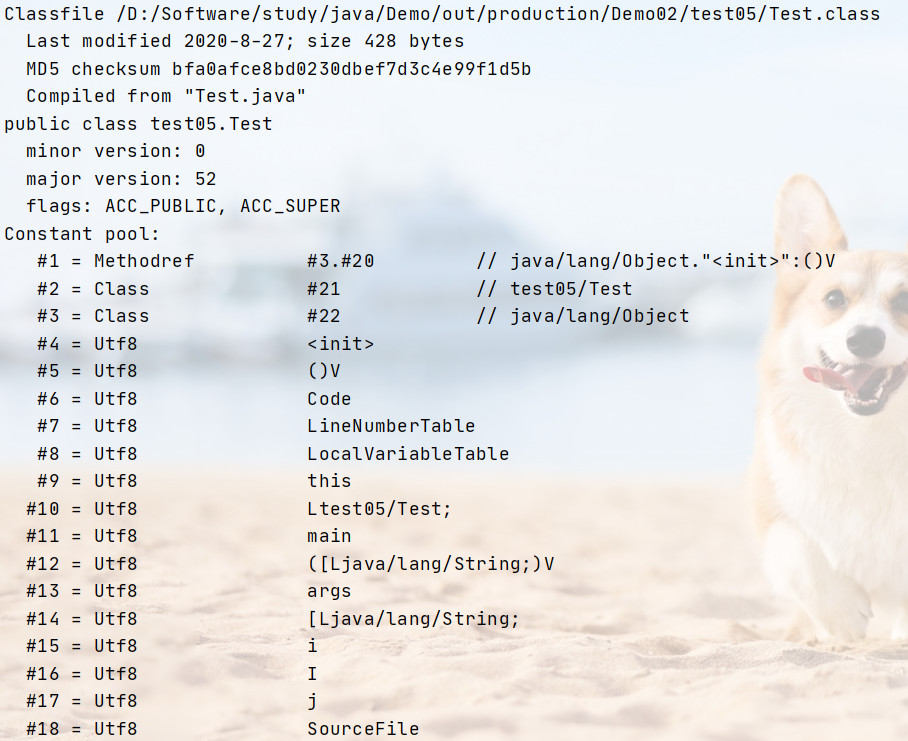
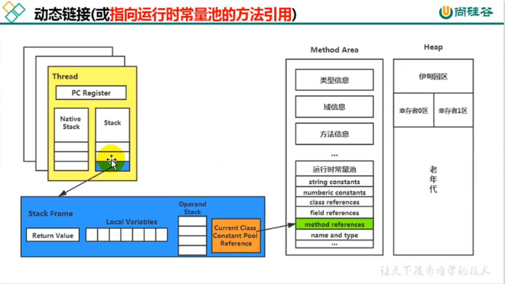

## 动态链接

1. 虚拟机栈中每一个栈帧内部都包含一个指向`运行时常量池`中该栈帧所述方法的引用(下图中Constant部分). 包含这个引用的目的就是为了支持当前方法的代码能实现动态链接(Dynamic Linking)

2. 在java源文件被编译到字节码文件中时,所有`变量`和`方法引用`都作为`符号引用`保存在class文件的常量池中. 当我们调用一个方法时, 就是通过字节码常量池中指向方法的符号引用来表示的, 动态链接就是将这些符号引用转换为具体的方法的直接引用.

3. 在JVM中,将符号引用转换为调用方法的直接引用与方法的绑定机制有关
    - `静态链接`: 当一个被调用的方法在编译期间可知,并且运行期间不会发生改变,那么这种情况下将符号引用转换为直接引用的过程称为静态链接(静态方法,final修饰的方法等).
    - `动态链接`: 当一个被调用的方法在编译期间无法被确定下来,即只能在运行期间将方法的符号引用转换为直接引用,由于这种转换方法具备动态性,因此被称为动态链接.(多态)

4. 绑定是一个字段、方法、类由符号引用替换为直接饮用的过程，这一过程仅发生一次，根据目标方法类型不同分为`早期绑定`和`晚期绑定`两种，分别对应`静态链接`和`动态链接`
    - `早期绑定`: 被调用的目标方法在编译期间可知并且运行期保持不变,即该方法表面类型和实际类型一致时,就可以知道其实际调用的目标方法是哪一个,这里就可以使用静态链接将符号引用转换为直接引用.
    - `晚期绑定`: 当一个被调用的方法的实际执行的方法在编译器无法确定,只能在程序运行期间根据实际类型进行绑定,那么这种绑定方式成为晚期绑定.

5. 虚方法和非虚方法
    - `非虚方法`: 如果方法在编译器就已经确定了具体的调用版本,并且这个版本在运行期间是不变的,那么这样的方法成为非虚方法.(在编译器就已经明确具体执行的是哪一个具体方法,俗称写死了)
    - 静态方法、私有方法、final方法、实例构造器、父类方法都是非虚方法(唯一,并且明确的指明是调用的哪一个具体方法)
    - `除上述方法外,其他方法成为虚方法`.

6. 方法重写的本质
    - 找到操作数栈顶的第一个元素所执行的对象的实际类型,记做C;
    - 如果在类型 C 中找到与常量中的描述符和名称都相符的方法,则进行访问权限校验, 如果通过校验则返回这个方法的直接引用,查找过程结束. 如果校验不通过则返回.
    - 如果在类型 C 中找不到对应的方法,则会依照继承关系依次从下往上对 C 的各个父类执行上一步的搜索验证. 
    - 如果始终都没有找到合适的方法,则抛出`java.lang.AbstractMethodError`