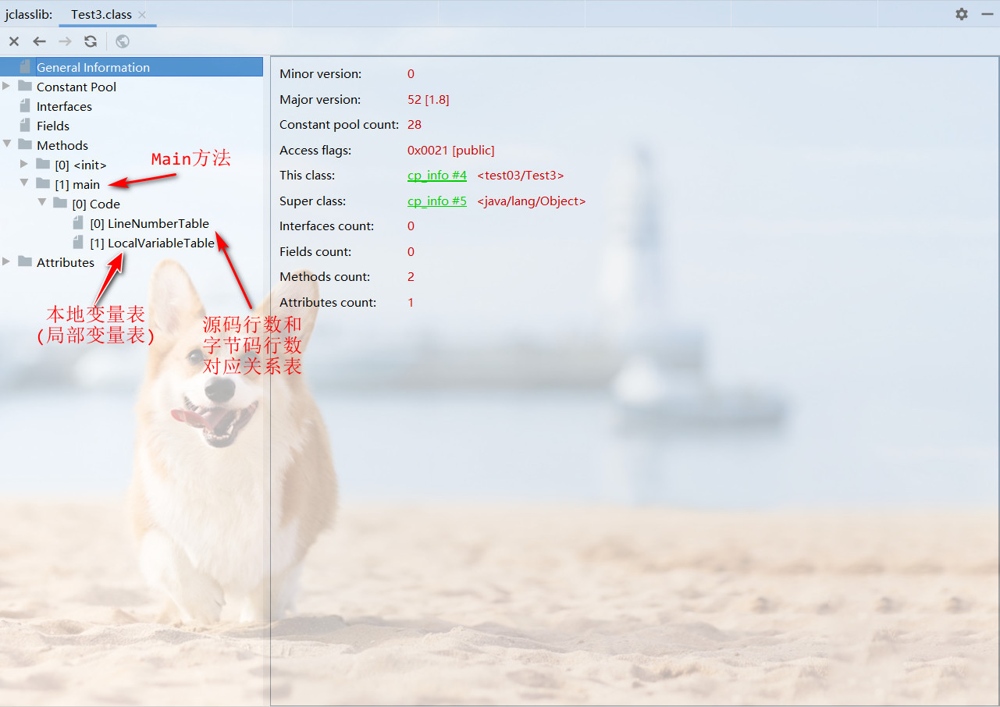
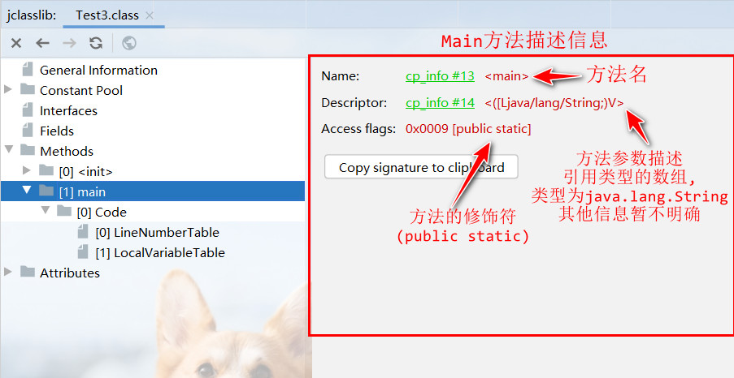
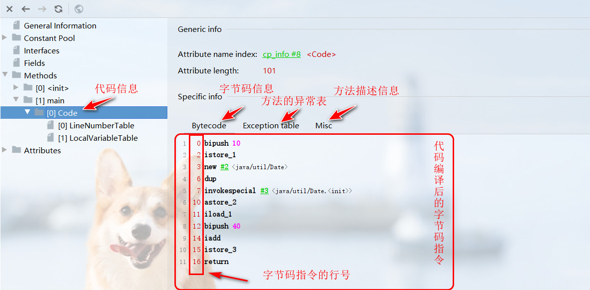
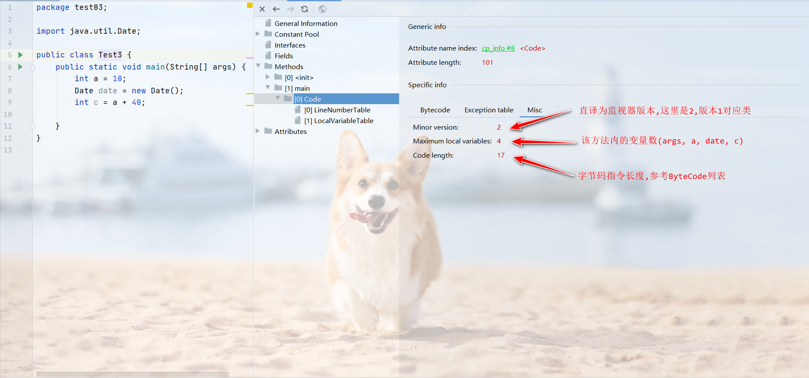
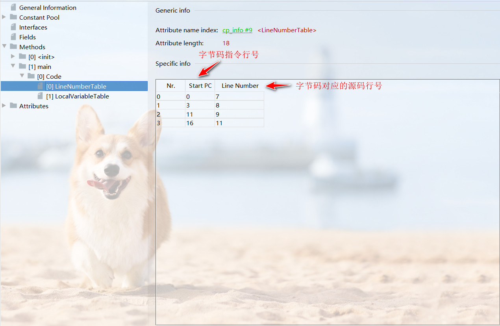
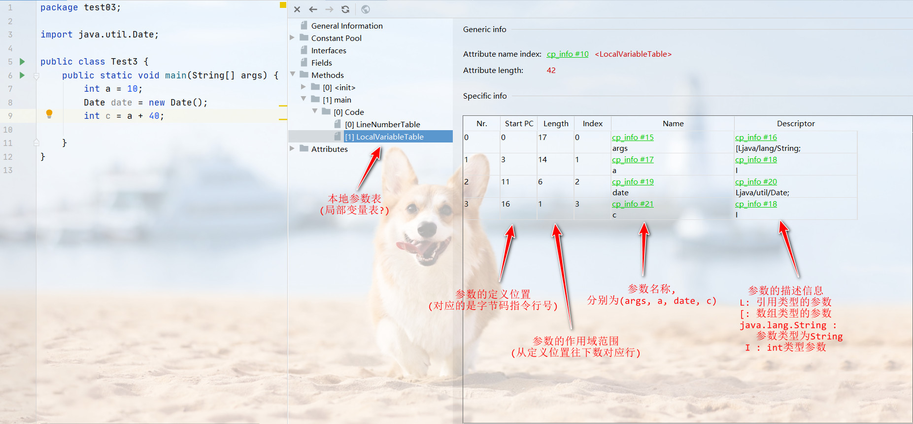

## 局部变量表

1. 虚拟机栈内部分为`局部表量表``、操作数栈`、`动态链接`、`方法出口`等信息. 本篇介绍局部变量表

2. 首先在idea中安装`jclasslib`插件,在插件库搜索即可. 安装完后选择编译后的class文件,点`view`菜单,选择`show bytecode with jclasslib`选项打开`jclasslib`视图.打开后展示信息如下
    

3. 这里我们以main方法举例,点击`[1]main`展示信息如下
    

4. 接下来打开`[1]main`目录下的`[0]code`目录, 展示信息如下,这里我们的main方法中没有抛出异常,所以异常变为空,不做展开.
    

5. 打开方法描述信息列表`Misc`,信息如下
    

6. 打开左侧代码行数`LineNumberTable`, 其中`Nr.`猜测为这个表的行号, `Start PC`为字节码指令的行号,详细信息参考`4`中的字节码信息表, `Line Number`为字节码对应的源码行号
    

7. 打开`localVariableTable`表,展示信息如下;
        

